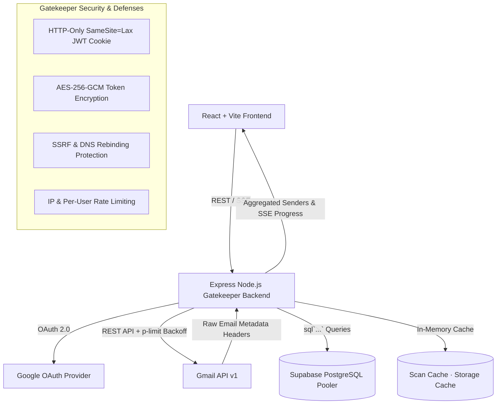

# EmailDiet — System Architecture, Design & Implementation Reference

**Version:** 4.0 · **Last Updated:** 2026-07-16
**Status:** Single-User SaaS & Personal Hub · Production-Ready · 161 tests passing across 17 suites · Clean production build

> This is the consolidated reference for EmailDiet's **architecture** (HLD + LLD) and **implementation details** (database schema, auth flow, service layer). Section 7 summarizes the design system; the full styling rulebook lives in [`DESIGN.md`](DESIGN.md).

---

## Table of Contents

1. [System Overview](#1-system-overview)
2. [High-Level Design (HLD)](#2-high-level-design-hld)
3. [Technology Stack](#3-technology-stack)
4. [System Architecture Diagram](#4-system-architecture-diagram)
5. [Backend Low-Level Design (LLD)](#5-backend-low-level-design-lld)
   - [Entry Point & Middleware Pipeline](#51-entry-point--middleware-pipeline)
   - [Database Layer (Postgres & Supabase)](#52-database-layer-postgres--supabase)
   - [Unified 1-to-1 User/Account Architecture](#53-unified-1-to-1-useraccount-architecture)
   - [Authentication, Sessions & Security Gatekeeper](#54-authentication-sessions--security-gatekeeper)
   - [Gmail Integration & Dynamic Pagination Layer](#55-gmail-integration--dynamic-pagination-layer)
   - [Services Layer](#56-services-layer)
   - [Job System & SSE Streaming](#57-job-system--sse-streaming)
   - [Store & Cache Layer](#58-store--cache-layer)
   - [API Routes](#59-api-routes)
   - [Configuration & Constants](#510-configuration--constants)
6. [Frontend Low-Level Design (LLD)](#6-frontend-low-level-design-lld)
   - [Component Architecture](#61-component-architecture)
   - [State Management & Hooks](#62-state-management--hooks)
   - [Network Layer (API Client)](#63-network-layer-api-client)
   - [Utilities](#64-utilities)
   - [Theme System](#65-theme-system)
7. [Design System (Apple HIG)](#7-design-system-apple-hig)
   - [Typography](#71-typography)
   - [Color System](#72-color-system)
   - [Spacing, Layout & Shapes](#73-spacing-layout--shapes)
   - [Component Inventory](#74-component-inventory)
8. [Security Model](#8-security-model)
9. [Data Flow Diagrams](#9-data-flow-diagrams)
10. [Database Schema (PostgreSQL / Supabase)](#10-database-schema-postgresql--supabase)
11. [Test Coverage (156 tests / 16 suites)](#11-test-coverage-156-tests--16-suites)

---

## 1. System Overview

EmailDiet is a full-stack **multi-user SaaS application and single-account Personal Hub** that connects to each user's single Gmail account via OAuth 2.0 (strict 1:1 user/account model) and provides powerful tools to:

- **Scan & categorize** subscription/promotional emails grouped by sender using dynamic scan limits
- **Bulk unsubscribe** via RFC 8058 one-click (with strict SSRF defense), mailto, or browser link
- **Reclaim storage** by analyzing large emails and attachments across customizable size bands
- **Organize** emails with auto-categorized Gmail labels under custom prefixes (`Unsub/`)
- **Protect** important senders (banks, government, utilities) from accidental actions via exact and subdomain matching
- **Export** sender data as Excel files for external analysis (`xlsx` SheetJS)
- **Schedule** weekly digest emails to detect new senders with zero double-firing

Every user account is strictly isolated using **Postgres / Supabase foreign keys (`user_id` ON DELETE CASCADE)**, HTTP-only JWT cookies, and **AES-256-GCM token encryption at rest**. Gmail is the authoritative source of truth — the app never stores email content locally, only temporary session metadata caches (`scanCache.js`). All deletions use Gmail `TRASH` label (recoverable for 30 days); there is no permanent-delete call (`messages.delete`) in the codebase.

---

## 2. High-Level Design (HLD)

### Core Tenets

| Tenet | Description |
|-------|-------------|
| **Gmail as source of truth** | The app never stores email bodies. All data is fetched from Gmail on the fly using `listMessagesPaginated` with dynamic database limits and cached in-memory for session performance. |
| **Safe deletion only** | Every "trash" operation uses Gmail's `TRASH` label. No `messages.delete` call exists. Users have 30 days to recover directly inside Gmail. |
| **Authoritative Node.js Gatekeeper** | The Node.js backend acts as an authoritative security gatekeeper over Supabase/Postgres. Client requests never hit Postgres directly (`postgres` connection pooling with `prepare: false` for PgBouncer transaction mode compatibility). |
| **Event-driven UI & SSE** | Long-running operations (scan, unsubscribe, trash, keep-latest) stream progress via **Server-Sent Events (SSE)** with `safeSend()` destroyed-socket guards and automatic polling fallback. |
| **Single-account tenant isolation** | Each user (`users`) corresponds to exactly one Google account (1:1 model). Every database query across all 12 child model repositories strictly partitions by `user_id` (`ON DELETE CASCADE`). |
| **SSRF & DNS Rebinding Defense** | One-click unsubscribe `POST` requests (`unsubscribeService.js`) pass through `assertSafeUrl` and `pinnedLookup`, resolving hostnames via DNS and blocking RFC 1918 private IPv4/IPv6, loopbacks (`127.0.0.1`), and internal networks. |

---

## 3. Technology Stack

| Layer | Technologies |
|-------|-------------|
| **Frontend** | React 18 + TypeScript, Vite 6, Chakra UI v2, Framer Motion, SheetJS (`xlsx`) |
| **Backend** | Node.js + Express (ESM modules), Google APIs (`googleapis`) |
| **Auth & Sessions** | Google OAuth 2.0 with HTTP-only signed SameSite=Lax JWT cookies (`auth_token`) |
| **Security Gatekeeper** | AES-256-GCM token encryption at rest (12-byte IVs, 16-byte auth tags), SSRF IP-pinning defense, security headers (`security.js`), per-user API rate limiting (`60 req/min`) |
| **Database** | **PostgreSQL / Supabase** (`postgres` driver) in PgBouncer transaction mode compatibility (`prepare: false`) with SARGable indexing and JSONB structured storage |
| **Testing** | Node.js built-in test runner (`node --test`), **138 unit tests passing across 15 test suites** |
| **Monorepo** | npm workspaces (`client/` + `server/`) |

### Server Dependencies

| Package | Purpose |
|---------|---------|
| `express` | HTTP server and routing |
| `postgres` | Modern, high-performance PostgreSQL client (`sql\`` template tags) |
| `googleapis` | Gmail API v1 client |
| `jsonwebtoken` | JWT session tokens |
| `cookie-parser` | HTTP-only cookie parsing |
| `cors` | Cross-origin resource sharing |
| `express-rate-limit` | Per-IP and per-user rate limiting |
| `p-limit` | Gmail API concurrency control (`p-limit(20)`) |
| `dotenv` | Environment variable loading |

### Client Dependencies

| Package | Purpose |
|---------|---------|
| `react` / `react-dom` | UI framework |
| `@chakra-ui/react` / `@chakra-ui/icons` | Component library |
| `@emotion/react` / `@emotion/styled` | CSS-in-JS (Chakra dependency) |
| `framer-motion` | Animations and transitions |
| `progressbar.js` | Animated progress indicators |
| `xlsx` (SheetJS) | Client-side Excel file generation |

---

## 4. System Architecture Diagram

```
┌────────────────────────────────────────────────────────────────────────┐
│                        CLIENT (Vite + React 18)                        │
│                                                                        │
│  LandingPage (Unauthed) ─→ App (Tab Router) ─┬→ MailboxTab             │
│                                              ├→ StorageTab             │
│                                              ├→ LabelManager           │
│                                              └→ AccountPage            │
│                                                                        │
│  Shared: ScanControls, SenderTable, FilterToolbar, AccountBadge        │
└───────────────────────────────────┬────────────────────────────────────┘
                                    │ HTTP REST + SSE
                                    │ credentials: 'include' (JWT cookie)
                                    ▼
┌────────────────────────────────────────────────────────────────────────┐
│                        SERVER (Express API)                            │
│                                                                        │
│  index.js ─→ CORS + CookieParser + GlobalRateLimit ─→ authMiddleware   │
│                                                                        │
│  ┌──────────────────────────────────────────────────────────────────┐  │
│  │                   PUBLIC ROUTES (no auth)                        │  │
│  │  GET /api/health · /api/auth/* · /legal/*                        │  │
│  ├──────────────────────────────────────────────────────────────────┤  │
│  │              PROTECTED ROUTES (JWT + per-user rate limit)        │  │
│  │  auth · user · scan · inbox · storage · labels · unsubscribe     │  │
│  │  protect · messages · jobs · digest                              │  │
│  └────────────────────────────────┬─────────────────────────────────┘  │
│                                   ▼                                    │
│  ┌──────────────────────────────────────────────────────────────────┐  │
│  │                      SERVICES (Scoped by userId)                 │  │
│  │  scanService · inboxService · storageService · unsubscribeService│  │
│  │  labelService · protectService · retentionService · trashService │  │
│  │  messageTrashService · categorizer · headerParser                │  │
│  │  digestService · digestRunner · subscriptionsService             │  │
│  │  auditService                                                    │  │
│  └────────────────────────────────┬─────────────────────────────────┘  │
│                                   ▼                                    │
│  ┌──────────────────────────────────────────────────────────────────┐  │
│  │                    DATA & INFRASTRUCTURE LAYER                   │  │
│  │  db.js & crypto.js — Postgres/Supabase + AES-256-GCM encryption │  │
│  │  jwt.js & authMiddleware.js — Signed JWT session verification    │  │
│  │  security.js — SSRF Defense, DNS-rebinding guards & headers      │  │
│  │  rateLimitMiddleware.js — Global IP + per-user rate limiting     │  │
│  │  jobManager.js & scheduler.js — User-scoped async background    │  │
│  │  scanCache.js / constants.js / preferences.js — caches & limits │  │
│  └────────────────────────────────┬─────────────────────────────────┘  │
└───────────────────────────────────┼────────────────────────────────────┘
                                    │
                    ┌───────────────┴───────────────┐
                    ▼                               ▼
       ┌─────────────────────────┐    ┌──────────────────────────┐
       │      Gmail API v1       │    │   Postgres / Supabase    │
       │  (googleapis library)   │    │ (prepare:false pooler)   │
       │  • messages.list/get    │    │  • users, accounts       │
       │  • messages.modify      │    │  • tokens, preferences   │
       │  • messages.trash       │    │  • protected_senders     │
       │  • messages.send        │    │  • label_registry        │
       │  • labels.create/list   │    │  • activity_log          │
       │  • users.getProfile     │    │  • digest_baseline       │
       └─────────────────────────┘    └──────────────────────────┘
```

### Data Flow (Mermaid)



---

## 5. Backend Low-Level Design (LLD)

### 5.1 Entry Point & Middleware Pipeline

**File:** `server/src/index.js`

The Express app initializes as an authoritative gatekeeper:

```
1. getDb()              → Initialize Supabase / Postgres connection pool on boot
2. cors()               → CORS with strict origin and credentials support
3. cookieParser()       → Parse auth_token HTTP-only cookie
4. express.json()       → JSON body parsing
5. securityHeaders      → X-Content-Type-Options, X-Frame-Options, CSP injection
6. globalRateLimiter    → 100 req/min per IP (all routes)
7. ── PUBLIC ROUTES ──
   /api/health          → { ok: true }
   /legal/*             → Privacy policy, terms
   /api/auth/*          → OAuth flow (no auth required)
8. authMiddleware       → Verify JWT, set req.userId & req.user
9. userRateLimiter      → 60 req/min per userId
10. ── PROTECTED ROUTES ── (all require auth & tenant isolation)
11. Error middleware     → NotConnectedError → 401, ApiError → JSON, else 500
12. startScheduler()    → Cron for weekly digest emails with single-job locking
13. SIGTERM handler     → closeDb() + graceful shutdown
```

### 5.2 Database Layer (Postgres & Supabase)

**Files:** `server/src/db/db.js`, `server/src/db/crypto.js`

| Module | Description |
|--------|-------------|
| `db.js` | Singleton `postgres` client instance connecting via `DATABASE_URL` / `SUPABASE` connection string. Configured with `prepare: false` for strict compatibility with **Supabase PgBouncer Transaction Mode (port 6543)**. Sets `max: 10` pool connections with 20s idle timeouts. Automatically triggers non-blocking initial schema migrations (`0001_initial_schema.sql`). Includes `setDbForTesting(mockSql)` for DI in unit tests. |
| `crypto.js` | AES-256-GCM encryption/decryption for OAuth tokens at rest (`tokens` table). Uses NIST SP 800-38D compliant 12-byte (96-bit) IVs and 16-byte authentication tags. Key is derived from `TOKEN_ENCRYPTION_KEY` env via SHA-256 normalization. |

### 5.3 Unified 1-to-1 User/Account Architecture

To enforce a clean, maintainable 1:1 architecture where each user corresponds to exactly one Google account with no multi-account switcher complexity, all repositories partition directly by `userId` (the Google `sub` ID):

- **`UserRepository` (`models/UserRepository.js`)**: Manages the unified `users` table (`id TEXT PRIMARY KEY`). Handles `upsert` on OAuth login and queries user profiles directly. (`AccountRepository.js` provides backward-compatible aliases exporting `UserRepository`).
- **`TokenRepository` (`models/TokenRepository.js`)**: Stores AES-256-GCM encrypted tokens keyed by `user_id`.
- **`PreferenceRepository` (`models/PreferenceRepository.js`)**: Manages per-user preferences (`default_time_range`, `scan_max_messages`, `label_prefix`, `digest_*`) strictly scoped by `user_id` using `ON CONFLICT (user_id) DO UPDATE`.
- **`ProtectedSenderRepository` (`models/ProtectedSenderRepository.js`)**: Manages `protected_senders` row-level domain and exact email allowlists keyed by `user_id`.
- **`LabelRegistryRepository`, `ActivityLogRepository`, `DigestBaselineRepository`, `ScanCacheRepository`, `SenderCacheRepository`, `CleanupHistoryRepository`, `WeeklyDigestRepository`, `SavedViewRepository`, `ScanMetadataRepository`**: All child tables strictly scope by `user_id` with `REFERENCES users(id) ON DELETE CASCADE` constraints.

### 5.4 Authentication, Sessions & Security Gatekeeper

**Files:** `server/src/auth/oauthClient.js`, `jwt.js`, `authMiddleware.js`, `middleware/security.js`, `rateLimitMiddleware.js`

| Module | Description |
|--------|-------------|
| `oauthClient.js` | OAuth2 client creation, auth URL generation with CSRF state tokens (10-min TTL), callback token exchange (`userinfo`), upserts into `users` and `accounts`, encrypts and stores tokens, automatic token refresh, `withAuthErrorHandling` wrapper (converts `invalid_grant` / expired tokens → 401 disconnect), and revoke/logout. |
| `security.js` | Authoritative SSRF and URL validation gatekeeper. Implements `assertSafeUrl(uri)` which parses protocols (`https:`) and performs DNS resolution (`dns.lookup` / `pinnedLookup` happy-eyeballs) to inspect resolved IP addresses via `isPrivateIp(ip)`. Blocks all loopbacks (`127.0.0.1`, `::1`), RFC 1918 private IPv4/IPv6 ranges (`10.x`, `172.16-31.x`, `192.168.x`, `fc00::`), link-local (`169.254.x`), and DNS rebinding attacks before executing HTTP `POST` requests. Also injects HTTP security headers (`securityHeaders`). |
| `jwt.js` | `signToken(userId)` → 7-day JWT with `{ sub: userId }`. `verifyToken(token)` → decoded payload or throws `TokenExpiredError`. |
| `authMiddleware.js` | Reads `auth_token` HTTP-only cookie → verifies JWT → sets `req.userId`. Returns 401 (`not_authenticated`, `token_expired`). |

### 5.5 Gmail Integration & Dynamic Pagination Layer

**Files:** `server/src/gmail/client.js`, `messages.js`, `mime.js`, `rateLimiter.js`, `utils/preferences.js`

| Module | Description |
|--------|-------------|
| `messages.js` | **`listMessagesPaginated(gmail, { q, labelIds, maxMessages, onProgress, signal })`**: Dynamically resolves `const limits = await getEffectiveScanLimits()` (`preferences.scan_max_messages`) from the database when `maxMessages` is undefined. Computes per-page requests as `Math.min(limits.maxMessages, remaining, LIST_LIMITS.GMAIL_API_PAGE_SIZE)` (where `GMAIL_API_PAGE_SIZE = 500`) and loops `while (pageToken && ids.size < effectiveMax)`. Delegates `listAllMessageIds` cleanly. Also provides `getMetadata` with concurrent header extraction. |
| `preferences.js` | **`getEffectiveScanLimits(userId)`**: Queries `preferences` via `PreferenceRepository.get(userId)`. Returns `{ maxMessages: prefs?.scanMaxMessages || SCAN_DEFAULTS.MAX_MESSAGES, timeRange: prefs?.defaultTimeRange || SCAN_DEFAULTS.TIME_RANGE }`. |
| `rateLimiter.js` | Shared `p-limit(20)` concurrency limiter with exponential backoff (500ms → 32s + jitter) on 429/5xx/403 rate limits. |
| `mime.js` | `parseMailto`, `buildUnsubscribeEmail` (with CRLF injection stripping), `base64url`. |

### 5.6 Services Layer

All services are strictly scoped by `userId` / `accountId` as the first parameter:

| Service | Key Functions | Description |
|---------|--------------|-------------|
| **`scanService.js`** | `scanSenders`, `runScan`, `scanView` | Scans candidate messages using `getEffectiveScanLimits()`, groups senders, determines best unsubscribe method (`one-click` > `mailto` > `link`). Auto-seeds protected categories post-scan. In-memory session caching (`scanCache.js`). |
| **`onboardingService.js`** | `getOnboardingState`, `configureOnboardingScan`, `autoSeedProtectedCategories`, `getMailboxStory`, `completeOnboarding`, `triggerOnboardingCelebrationIfApplicable` | First login onboarding lifecycle (`welcome` $\rightarrow$ `scanning` $\rightarrow$ `story` $\rightarrow$ `completed`). Evaluates `shouldStartAtDashboard`, computes Mailbox Story metrics, and returns instant celebration time-saved metrics on first cleanup. |
| **`insights/` Engine (`normalizationEngine`, `scoringEngine`, `insightsEngine`) & `insightsService.js`** | `getDashboardInsights`, `recalculateInsights`, `calculateHealthScore`, `generateAllWidgets` | Deterministic Mailbox Health Score (0-100) across 6 weighted dimensions. Generates 14+ explainable widgets (`why` + `action` objects) and 7 gamification badges. Caches atomically into `ScanCacheRepository` (`dashboard_json`). |
| **`inboxService.js`** | `listGroups`, `getGroup` | Reports live counts for 11 inbox groups using `listMessagesPaginated`. |
| **`storageService.js`** | `getStorageStats`, `fetchLargeMessages` | Scans emails >500KB using dynamic `limits.maxMessages`. Aggregates top senders (`LIST_LIMITS.TOP_SENDERS_CHART`), months, years, and size bands (`SIZE_BANDS`). |
| **`unsubscribeService.js`** | `runUnsubscribe` | Executes one-click POST (`assertSafeUrl` SSRF pinned defense), mailto, or link. Logs to `ActivityLogRepository` and triggers onboarding celebrations on first cleanup. |
| **`labelService.js`** | `runApplyLabels`, `getLabelMessages` | Creates/applies labels under `preferences.label_prefix` (`Unsub/`). Paginates up to `LIST_LIMITS.MESSAGES_DEFAULT`. |
| **`protectService.js`** | `autoProtectFromScan`, `protectSenders` | Auto-detects banks/utilities/government via heuristics. Enforces `LIST_LIMITS.SENDERS_DEFAULT`. |
| **`trashService.js` & `messageTrashService.js`** | `trashMessagesBatch`, `emptyTrash` | Moves emails to Gmail `TRASH`. `emptyTrash` respects dynamic DB limits (`while (deleted < limits.maxMessages)`). Triggers onboarding celebrations on first cleanup. |
| **`retentionService.js`** | `keepLatest` | Keep-latest-N email retention engine. |
| **`digestService.js` & `digestRunner.js`** | `runDigest` | Weekly digest diff detection, HTML building, sending, and baseline upserting (`digest_baseline`). |
| **`auditService.js`** | `logActivity`, `getActivity` | Paginated audit feed (`LIST_LIMITS.AUDIT_PAGE_DEFAULT`). |

### 5.7 Job System & SSE Streaming

**Files:** `server/src/jobs/jobManager.js`, `scheduler.js`, `server/src/routes/jobs.js`

- **`jobManager.js`**: UUID-based async job tracking (`createJob`, `cancelJob`, `getJob`, `isJobRunning`). Prunes finished jobs (keeps last 50).
- **`routes/jobs.js`**: `GET /:id/events` SSE endpoint with `safeSend()` destroyed-socket guards (`if (res.destroyed || res.writableEnded) return`), once-only cleanup (`cleaned` flag), and 15s heartbeat pings to eliminate proxy `ECONNRESET` disconnect errors.

### 5.8 Store & Cache Layer

| Store | Persistence | Description |
|-------|------------|-------------|
| `scanCache.js` | In-memory Map | Per-user session scan results. |
| `ScanCacheRepository.js` | Postgres (`cache_scans` / `scan_cache` table) | Atomic persistence of `dashboard_json` (JSONB) for sub-10ms dashboard loads. |
| `labelRegistry.js` | Postgres (`label_registry`) | Mapping of label names → Gmail IDs (`LIMIT ${LIST_LIMITS.LABELS}`). |
| `digestStore.js` | Postgres (`preferences` + `digest_baseline`) | Retains up to `LIST_LIMITS.DIGEST_HISTORY_MAX` weekly run entries. |

**Supported job types:**
- `scan` — Inbox scan for subscription senders
- `unsubscribe` — Execute batch unsubscribe actions
- `apply-labels` — Batch label application
- `trash` — Batch message trashing (per-sender and per-filter)
- `keep-latest` — Retention engine
- `digest` — Weekly digest email

**SSE resilience:** The SSE endpoint uses `safeSend()` with `res.destroyed || res.writableEnded` guards, try/catch on every write, once-only cleanup via a `cleaned` flag, and heartbeat liveness checks to prevent `ECONNRESET` errors through the Vite dev proxy.

### 5.9 API Routes

| Route Group | Endpoints | Auth | Purpose |
|-------------|-----------|------|---------|
| `GET /api/health` | Health check | ✗ | Returns `{ ok: true }` |
| `/legal/*` | Privacy, Terms | ✗ | Legal pages for OAuth verification |
| `/api/auth` | `GET /url`, `GET /callback`, `GET /status`, `POST /logout` | ✗ | OAuth flow |
| `/api/user` | `GET /profile`, `GET/PUT /preferences`, `GET /activity`, `DELETE /account` | ✓ | User profile & settings |
| `/api/user/onboarding` | `GET /`, `PATCH /`, `POST /configure`, `GET /story`, `POST /complete` | ✓ | First login onboarding workflow & Mailbox Story |
| `/api/insights` | `GET /dashboard`, `GET /health`, `GET /priorities`, `GET /dna`, `GET /achievements`, `POST /recalculate` | ✓ | Deterministic Mailbox Health Score & 14+ widgets |
| `/api/scan` | `POST /scan`, `GET /scan`, `GET /senders`, `GET /suggestions`, `GET /subscriptions` | ✓ | Scan management |
| `/api/inbox` | `GET /groups`, `GET /group/:key/messages`, `GET /filters`, `POST /filter/messages`, `POST /filter/:key/trash` | ✓ | Inbox analytics |
| `/api/storage` | `GET /stats`, `GET /drill`, `POST /refresh` | ✓ | Storage analysis |
| `/api/labels` | `POST /apply`, `POST /apply-filter`, `DELETE /:name`, `GET /labels` | ✓ | Label management |
| `/api/unsubscribe` | `POST /unsubscribe` | ✓ | Execute unsubscribe |
| `/api/protect` | `GET /protected`, `POST /protect`, `DELETE /protect` | ✓ | Protected senders |
| `/api/messages` | `POST /trash` | ✓ | Trash messages |
| `/api/jobs` | `GET /:id`, `POST /:id/cancel`, `GET /:id/events` | ✓ | Job management & SSE |
| `/api/digest` | `GET /state`, `POST /settings`, `POST /run`, `POST /test` | ✓ | Digest configuration |

### 5.10 Configuration

**File:** `server/src/config.js`

Environment-driven configuration via `.env`:

| Variable | Default | Description |
|----------|---------|-------------|
| `GOOGLE_CLIENT_ID` | *(required)* | Google OAuth client ID |
| `GOOGLE_CLIENT_SECRET` | *(required)* | Google OAuth client secret |
| `PORT` | `3001` | API server port |
| `HOST` | `127.0.0.1` | Bind address (loopback for security) |
| `REDIRECT_URI` | `http://localhost:3001/api/auth/callback` | OAuth redirect |
| `CLIENT_URL` | `http://localhost:5173` | Frontend URL |
| `DB_PATH` | `server/data/emaildiet.db` | SQLite database path |
| `JWT_SECRET` | *(auto-generated)* | JWT signing secret (⚠️ sessions won't survive restart without this) |
| `TOKEN_ENCRYPTION_KEY` | *(required)* | AES-256-GCM encryption key for tokens at rest |
| `COOKIE_DOMAIN` | `undefined` | Cookie domain (set for cross-subdomain deployment) |
| `CORS_ORIGIN` | Same as `CLIENT_URL` | CORS allowed origin |
| `SCAN_MAX_MESSAGES` | `Infinity` (no cap) | Max messages to scan |
| `RATE_LIMIT_PER_MINUTE` | `60` | Per-user rate limit |

**OAuth Scopes:**
- `gmail.modify` — Read, label, trash emails
- `gmail.send` — Send unsubscribe emails
- `userinfo.profile` — Google display name and avatar
- `userinfo.email` — Google email address

---

## 6. Frontend Low-Level Design (LLD)

### 6.1 Component Architecture

```
App.tsx (Tab navigation + auth state + theme)
├── LandingPage.tsx        — SaaS marketing page (unauthenticated view)
├── ConnectScreen.tsx       — Legacy OAuth login card
├── AccountBadge.tsx        — User avatar, email, profile trigger, logout
├── AccountPage.tsx         — Full profile, preferences, activity audit log
├── UserProfileModal.tsx    — Profile & preferences modal (alternative view)
│
├── MailboxTab.tsx           — Primary sender management view
│   ├── ScanControls.tsx     — Scan launcher + time range + stats
│   ├── ScanLoader.tsx       — Animated scan progress display
│   ├── FilterToolbar.tsx    — Smart filter chips (engagement/cleanup/category)
│   ├── TagSearchInput.tsx   — Multi-filter chips search (tag:/from:/is:… + suggestions)
│   ├── SenderTable.tsx      — Sortable sender table with bulk selection
│   ├── UnsubscribePanel.tsx — Unsubscribe progress/results display
│   ├── LabelReview.tsx      — Label assignment review dialog
│   ├── ProtectedTab.tsx     — Protected sender management
│   └── ConfirmDialog.tsx    — Typed confirmation for destructive actions
│
├── StorageTab.tsx           — Left/right pane storage analyzer
│   └── DrillPanel (inline)  — Filterable message detail table
│
├── LabelManager.tsx         — System/User/App label sidebar + message drill-down
│
└── DigestSettingsDialog.tsx  — Weekly digest configuration modal

Shared Utilities:
├── AnimatedProgress.tsx     — ProgressBar.js animated circular/linear indicators
├── EmailLoader.tsx          — Animated envelope loader for async operations
└── ConfirmDialog.tsx        — Standard armed-delay confirmation
```

### 6.2 State Management & Hooks

| Hook | File | Description |
|------|------|-------------|
| `useJob` | `hooks/useJob.ts` | Manages async job lifecycle: starts a job via POST, opens SSE stream to `/api/jobs/:id/events`, falls back to 2s polling on SSE error. Returns `{ job, running, start, cancel }`. |
| `useAuth` | `hooks/useAuth.ts` | Authentication state management. Checks `/api/auth/status` on mount, provides `login`, `logout`, `connected`, `user` state. |
| `useAutoClearAlert` | `hooks/useAutoClearAlert.ts` | Auto-clears alert messages after a timeout. |

### 6.3 Network Layer (API Client)

**File:** `client/src/api.ts`

Typed HTTP client with `ApiError` class. All requests use `credentials: 'include'` for cookie-based auth. Methods for every API endpoint, organized by domain.

### 6.4 Utilities

| File | Description |
|------|-------------|
| `utils/exportExcel.ts` | Client-side Excel export using SheetJS. `exportToExcel(senders)` maps sender data to rows with Email, Name, First Name, Last Name, Domain columns. Splits names on first space. Auto-sizes column widths. Downloads as `Email_export_<unix_timestamp>.xlsx`. |
| `cache.ts` | Client-side caching utility for API responses. |

### 6.5 Theme System

**Files:** `theme/themes.ts`, `theme/ThemeContext.tsx`

| Module | Description |
|--------|-------------|
| `themes.ts` | Two curated Chakra UI themes — **Botanical Forest** (nature-inspired greens/teals on warm backgrounds) and **Espresso** (rich warm browns/coppers on cream). Both include full dark mode `_dark` variants, semantic tokens (`bg.app`, `bg.card`, `bg.glass`, `text.primary`, `text.secondary`, `border.glass`, `brand.icon`), and shared component overrides (pill-shaped buttons/tabs/tags, `3xl` glass cards and modals with `backdrop-filter: blur(12px)`). |
| `ThemeContext.tsx` | React context providing `theme` (`botanical` or `espresso`) and `setTheme`. Persists the choice in `localStorage` under the `app-theme` key (default `botanical`). Dark/light mode is handled separately via Chakra's `useColorMode` toggle in `App.tsx` — config is `initialColorMode: 'light'`, `useSystemColorMode: false`, so there is no OS `prefers-color-scheme` sync. |

---

## 7. Design System (Apple HIG)

The app follows an **Apple Human Interface Guidelines (HIG)**-inspired design language: system fonts, Apple system colors, rounded rectangles, translucent materials, hairline separators, and restrained shadows.

### 7.1 Typography

| Element | Specification |
|---------|--------------|
| **Primary Font** | `-apple-system, BlinkMacSystemFont, "SF Pro Text", "SF Pro Display", "Helvetica Neue", Helvetica, Arial, sans-serif` (renders SF on Apple devices, native sans elsewhere, no web-font import) |
| **Mono Font** | `ui-monospace, "SF Mono", "SFMono-Regular", Menlo, Consolas, monospace` |
| **Scale** | 15px body, 13px secondary body, 17–22px section titles, 28px page title |
| **Letter-spacing** | Negative (`-0.01em` to `-0.02em`) on headings |
| **Weights** | 400 body, 500/590/600 controls/labels, 700 headers |

### 7.2 Color System

Apple system colors exposed as Chakra UI semantic tokens and CSS variables:

```css
:root {
  --color-dominant: #1C1C1E;              /* primary text/icons */
  --color-dominant-light: #F2F2F7;        /* systemGroupedBackground */
  --color-accent: #007AFF;                /* systemBlue (primary actions) */
  --color-accent-soft: rgba(0,122,255,0.10);
  --hairline: rgba(60,60,67,0.18);        /* separator */
}
```

**Full system palette:** Blue `#007AFF`, Indigo `#5856D6`, Green `#34C759`, Orange `#FF9500`, Red `#FF3B30`, Pink `#FF2D55`, Teal `#00C7BE`. Secondary text: `rgba(60,60,67,0.60)`. Single accent (systemBlue) for primary actions — no per-tab accent colors.

### 7.3 Spacing, Layout & Shapes

| Element | Specification |
|---------|--------------|
| **Grid** | 8px rhythm (8/16/24/32/48/64) |
| **Card corners** | 14px rounded rectangles |
| **Dialog corners** | 18px |
| **Floating trays** | 16px corners |
| **Inputs/buttons** | 10px corners |
| **Chips/badges** | 8px corners |
| **Shadows** | Restrained: `0 1px 2px rgba(0,0,0,0.04), 0 10px 30px rgba(0,0,0,0.05)` |
| **Toolbar material** | `rgba(255,255,255,0.72)` with `backdrop-filter: saturate(180%) blur(20px)` |
| **Action tray material** | `rgba(28,28,30,0.92)` with backdrop blur, white text |
| **Separators** | Hairline borders at `rgba(60,60,67,0.10–0.18)` |
| **Layout pattern** | Two-Pane Master-Detail: left `GridItem md=4 lg=3` (navigation/filters), right `GridItem md=8 lg=9` (tables/detail) |
| **Table aesthetics** | Sentence Case headers, `brand.50` background, 1px border, inset 3px left-edge highlight on selected rows (no background color change), standard pagination |

### 7.4 Component Inventory

| Component | Purpose |
|-----------|---------|
| `LandingPage` | Full-page SaaS marketing hero, benefits, trust signals, Google OAuth login |
| `UserProfileModal` | Account profile, preferences editor, activity audit log modal |
| `AccountBadge` | User avatar, email, profile modal trigger, logout |
| `ConfirmDialog` | Standard confirmation dialog (arming delay + typed confirm) |
| `ConnectScreen` | Legacy OAuth login card |
| `EmailLoader` | Animated envelope loader for async operations |
| `FilterToolbar` | Preset query chip toolbar for email filtering |
| `LabelManager` | Label creation, application, and management system |
| `LabelReview` | Inline label inspector and category assignment |
| `ProtectedTab` | Protected sender whitelist manager |
| `ScanControls` | Scan trigger buttons with status messages |
| `ScanLoader` | Scan progress animation (listing → fetching → grouping) |
| `SenderTable` | Sender table with selection, volume stats, category badges |
| `StorageTab` | Storage analyzer with drill-down by sender/month/year/size |
| `UnsubscribePanel` | Batch unsubscribe progress and results display |
| `DigestSettingsDialog` | Weekly digest schedule and recipient configuration |
| `AnimatedProgress` | ProgressBar.js animated indicators |
| `AccountPage` | Full profile, preferences, activity log (dedicated page) |

---

## 8. Security Model

| Layer | Implementation |
|-------|---------------|
| **OAuth 2.0** | Google OAuth with CSRF state tokens (10-minute TTL, 16-byte random) |
| **Session cookies** | HTTP-only, `SameSite=Lax`, signed JWT (`auth_token`), 7-day expiry |
| **Token encryption** | AES-256-GCM with NIST SP 800-38D compliant 12-byte IVs and 16-byte auth tags. Key derived via SHA-256 from env variable. |
| **Token refresh** | Automatic refresh with `invalid_grant` detection → 401 + token deletion |
| **Rate limiting** | Global: 100 req/min per IP. Per-user: 60 req/min (configurable). Scan concurrency: max 1 per user. |
| **SSRF protection** | One-click unsubscribe POST restricted to HTTPS; DNS resolution blocks private IPs, localhost, and loopback addresses |
| **Header injection** | Sanitization in MIME email construction for mailto unsubscribe flows |
| **Gmail scopes** | Minimal: `gmail.modify` + `gmail.send` (no `gmail.readonly` or full access) |
| **Data isolation** | SQLite foreign keys with `ON DELETE CASCADE`. `req.userId` enforced at middleware level before any route handler executes. |
| **Safe deletion** | Only Gmail Trash (30-day recovery). No `messages.delete` call exists in the codebase. |
| **Protect-list enforcement** | Unsubscribe, trash, keep-latest, and filter-trash all check `isProtected()` before acting. |

---

## 9. Data Flow Diagrams

### Scan Flow
```
User clicks "Scan" → POST /api/scan { range: "6m" }
  → jobManager.createJob(userId, 'scan', runner)
    → gmail.messages.list (paginated, rate-limited, AbortSignal)
      SSE: { phase: "listing", listed: 150 }
    → gmail.messages.get (parallel × 20, rate-limited)
      SSE: { phase: "fetching", fetched: 80, total: 150 }
    → Group by sender, detect unsubscribe methods, categorize
      SSE: { phase: "grouping", total: 150 }
    → Cache in scanCache[userId]
  → Client polls GET /api/jobs/:id (or streams SSE /events)
  → Client fetches GET /api/scan for results
```

### Unsubscribe Flow
```
User selects senders → POST /api/unsubscribe { emails: [...] }
  → Filter out protected senders (report excluded count)
  → For each sender:
    → oneclick? → HTTPS POST to List-Unsubscribe URL (SSRF check)
    → mailto?   → Build MIME email → gmail.messages.send
    → link?     → Return URL for manual browser open
  → Return { total, success, manual, failed, results[] }
```

### Storage Analysis Flow
```
User opens Storage tab → GET /api/storage/stats
  → Fetch all emails > 500KB (paginated)
  → Aggregate by sender (top 10), month, year, size band
  → Cache for 5 minutes
  → Client renders left pane (aggregations) + right pane (drill-down)

User clicks month → GET /api/storage/drill?by=month&value=2025-06
  → Filter cached messages by month
  → Return sorted message list
```

### Excel Export Flow
```
User clicks ⬇ export icon in Senders toolbar
  → Client checks: selectedSenders.size > 0 ?
    → YES: export only selected from visibleSenders
    → NO:  export all visibleSenders (respects segment/category/search)
  → exportToExcel(senders):
    → splitName("John Smith") → { first: "John", last: "Smith" }
    → XLSX.utils.json_to_sheet → auto-size columns
    → XLSX.writeFile → browser download
    → File: Email_export_<unix_timestamp>.xlsx
```

---

## 10. Database Schema (PostgreSQL / Supabase - 13 Tables)

```sql
-- 13 tables supporting unified 1:1 user/account architecture and persistent caching on Supabase PostgreSQL (`prepare: false` pooler)

CREATE TABLE users (
  id            TEXT PRIMARY KEY,        -- Google sub (unique, stable)
  email         TEXT NOT NULL UNIQUE,
  display_name  TEXT,
  avatar_url    TEXT,
  created_at    TIMESTAMPTZ DEFAULT CURRENT_TIMESTAMP,
  last_login_at TIMESTAMPTZ
);

CREATE TABLE tokens (
  user_id       TEXT PRIMARY KEY REFERENCES users(id) ON DELETE CASCADE,
  encrypted     TEXT NOT NULL,           -- AES-256-GCM encrypted JSON blob
  iv            TEXT NOT NULL,           -- 12-byte IV (base64)
  updated_at    TIMESTAMPTZ DEFAULT CURRENT_TIMESTAMP
);

CREATE TABLE preferences (
  user_id                   TEXT PRIMARY KEY REFERENCES users(id) ON DELETE CASCADE,
  scan_max_messages         INTEGER,
  default_time_range        TEXT DEFAULT '3m',
  label_prefix              TEXT DEFAULT 'Unsub/',
  digest_enabled            INTEGER DEFAULT 0,
  digest_day                INTEGER NOT NULL DEFAULT 1,
  digest_hour               INTEGER NOT NULL DEFAULT 8,
  digest_recipient          TEXT NOT NULL DEFAULT '',
  digest_senders            JSONB DEFAULT '[]'::jsonb,
  onboarding_step           TEXT DEFAULT 'welcome',
  has_completed_onboarding  INTEGER DEFAULT 0,
  protected_categories      JSONB DEFAULT '[]'::jsonb
);

CREATE TABLE protected_senders (
  id        BIGSERIAL PRIMARY KEY,
  user_id   TEXT REFERENCES users(id) ON DELETE CASCADE,
  email     TEXT NOT NULL,
  domain    TEXT,
  source    TEXT DEFAULT 'manual',      -- 'auto' | 'manual'
  added_at  TIMESTAMPTZ DEFAULT CURRENT_TIMESTAMP,
  UNIQUE(user_id, email)
);

CREATE TABLE label_registry (
  id          BIGSERIAL PRIMARY KEY,
  user_id     TEXT NOT NULL REFERENCES users(id) ON DELETE CASCADE,
  label_name  TEXT NOT NULL,
  gmail_id    TEXT NOT NULL,
  created_at  TIMESTAMPTZ DEFAULT CURRENT_TIMESTAMP,
  UNIQUE(user_id, label_name)
);

CREATE TABLE activity_log (
  id          BIGSERIAL PRIMARY KEY,
  user_id     TEXT NOT NULL REFERENCES users(id) ON DELETE CASCADE,
  action      TEXT NOT NULL,            -- 'login' | 'logout' | 'scan' | 'unsubscribe' | 'trash' | 'label' | 'keep_latest'
  details     JSONB,                    -- Structured JSON blob with action-specific metrics
  created_at  TIMESTAMPTZ DEFAULT CURRENT_TIMESTAMP
);

CREATE TABLE digest_baseline (
  user_id     TEXT PRIMARY KEY REFERENCES users(id) ON DELETE CASCADE,
  senders     JSONB DEFAULT '[]'::jsonb,-- JSON array of known sender emails
  last_run_at TIMESTAMPTZ,
  updated_at  TIMESTAMPTZ DEFAULT CURRENT_TIMESTAMP
);

-- Table 8: scan_cache (Dashboard widget cache, 1 row per user)
CREATE TABLE scan_cache (
  user_id                TEXT PRIMARY KEY REFERENCES users(id) ON DELETE CASCADE,
  last_scan              TIMESTAMPTZ DEFAULT CURRENT_TIMESTAMP,
  total_messages         INTEGER DEFAULT 0,
  total_senders          INTEGER DEFAULT 0,
  unread_messages        INTEGER DEFAULT 0,
  storage_used_mb        NUMERIC(10, 2) DEFAULT 0,
  recoverable_storage_mb NUMERIC(10, 2) DEFAULT 0,
  health_score           SMALLINT DEFAULT 100,
  cleanup_score          SMALLINT DEFAULT 100,
  organization_score     SMALLINT DEFAULT 100,
  security_score         SMALLINT DEFAULT 100,
  newsletter_count       INTEGER DEFAULT 0,
  large_attachment_count INTEGER DEFAULT 0,
  mailbox_dna            JSONB DEFAULT '{}'::jsonb,
  dashboard_json         JSONB DEFAULT '{}'::jsonb,
  updated_at             TIMESTAMPTZ DEFAULT CURRENT_TIMESTAMP
);

-- Table 9: sender_cache (One row per sender per user; zero email bodies stored)
CREATE TABLE sender_cache (
  id              BIGSERIAL PRIMARY KEY,
  user_id         TEXT NOT NULL REFERENCES users(id) ON DELETE CASCADE,
  sender_email    TEXT NOT NULL,
  sender_name     TEXT,
  domain          TEXT,
  category        TEXT DEFAULT 'Other',
  total_messages  INTEGER DEFAULT 0,
  unread_messages INTEGER DEFAULT 0,
  storage_mb      NUMERIC(10, 2) DEFAULT 0,
  first_received  TIMESTAMPTZ,
  last_received   TIMESTAMPTZ,
  open_rate       SMALLINT DEFAULT 0,
  health_score    SMALLINT DEFAULT 100,
  recommendation  TEXT DEFAULT 'Review',
  verified        BOOLEAN DEFAULT FALSE,
  protected       BOOLEAN DEFAULT FALSE,
  updated_at      TIMESTAMPTZ DEFAULT CURRENT_TIMESTAMP,
  UNIQUE(user_id, sender_email)
);

-- Table 10: cleanup_history (Historical cleanup session metrics)
CREATE TABLE cleanup_history (
  id                 BIGSERIAL PRIMARY KEY,
  user_id            TEXT NOT NULL REFERENCES users(id) ON DELETE CASCADE,
  emails_removed     INTEGER NOT NULL DEFAULT 0,
  storage_saved_mb   NUMERIC(10, 2) NOT NULL DEFAULT 0,
  time_saved_seconds INTEGER NOT NULL DEFAULT 0,
  duration_seconds   INTEGER NOT NULL DEFAULT 0,
  created_at         TIMESTAMPTZ DEFAULT CURRENT_TIMESTAMP
);

-- Table 11: weekly_digest (Weekly report summary snapshots)
CREATE TABLE weekly_digest (
  id           BIGSERIAL PRIMARY KEY,
  user_id      TEXT NOT NULL REFERENCES users(id) ON DELETE CASCADE,
  week_start   DATE NOT NULL,
  summary      JSONB NOT NULL DEFAULT '{}'::jsonb,
  generated_at TIMESTAMPTZ DEFAULT CURRENT_TIMESTAMP,
  UNIQUE(user_id, week_start)
);

-- Table 12: saved_views (Custom Mailbox Explorer sidebar filters)
CREATE TABLE saved_views (
  id          BIGSERIAL PRIMARY KEY,
  user_id     TEXT NOT NULL REFERENCES users(id) ON DELETE CASCADE,
  name        TEXT NOT NULL,
  filter_json JSONB NOT NULL DEFAULT '{}'::jsonb,
  sort_json   JSONB NOT NULL DEFAULT '{}'::jsonb,
  created_at  TIMESTAMPTZ DEFAULT CURRENT_TIMESTAMP,
  UNIQUE(user_id, name)
);

-- Table 13: scan_metadata (Operational profiling, timing & error diagnostics with 100-run retention cap)
CREATE TABLE scan_metadata (
  scan_id        BIGSERIAL PRIMARY KEY,
  user_id        TEXT NOT NULL REFERENCES users(id) ON DELETE CASCADE,
  started_at     TIMESTAMPTZ NOT NULL DEFAULT CURRENT_TIMESTAMP,
  completed_at   TIMESTAMPTZ,
  emails_scanned INTEGER DEFAULT 0,
  senders_found  INTEGER DEFAULT 0,
  duration_ms    INTEGER DEFAULT 0,
  status         TEXT NOT NULL DEFAULT 'running', -- 'success' | 'failed' | 'cancelled'
  error_message  TEXT
);

-- SARGable Performance Indexes (`Equality -> Range/Sort`, created CONCURRENTLY for zero locking)
CREATE INDEX CONCURRENTLY IF NOT EXISTS idx_label_registry_user ON label_registry(user_id);
CREATE INDEX CONCURRENTLY IF NOT EXISTS idx_activity_log_user_created ON activity_log(user_id, created_at DESC);
CREATE INDEX CONCURRENTLY IF NOT EXISTS idx_activity_log_action ON activity_log(action);
CREATE INDEX CONCURRENTLY IF NOT EXISTS idx_protected_senders_user_domain ON protected_senders(user_id, domain);
CREATE INDEX CONCURRENTLY IF NOT EXISTS idx_sender_cache_user_category_received ON sender_cache(user_id, category, last_received DESC);
CREATE INDEX CONCURRENTLY IF NOT EXISTS idx_sender_cache_user_domain ON sender_cache(user_id, domain);
CREATE INDEX CONCURRENTLY IF NOT EXISTS idx_sender_cache_user_received ON sender_cache(user_id, last_received DESC);
CREATE INDEX CONCURRENTLY IF NOT EXISTS idx_cleanup_history_user_created ON cleanup_history(user_id, created_at DESC);
CREATE INDEX CONCURRENTLY IF NOT EXISTS idx_weekly_digest_user_week ON weekly_digest(user_id, week_start DESC);
CREATE INDEX CONCURRENTLY IF NOT EXISTS idx_saved_views_user_name ON saved_views(user_id, name ASC);
CREATE INDEX CONCURRENTLY IF NOT EXISTS idx_scan_metadata_user_started ON scan_metadata(user_id, started_at DESC);
```

---

## 11. Test Coverage (161 tests / 17 suites)

17 automated test suites verified by Node.js built-in test runner (`node --test`), covering all repositories, services, utilities, and security gatekeeper defenses (`161/161 passing`):

| Suite | Tests | Coverage Area |
|-------|-------|---------------|
| `categorizer.test.js` | 7 | Domain matching, subject keywords, Gmail category fallback |
| `headerParser.test.js` | 14 | From parsing (RFC 2047), List-Unsubscribe extraction, one-click detection |
| `inboxService.test.js` | 4 | Group key uniqueness, label/query validation |
| `mime.test.js` | 4 | Mailto parsing, MIME building, header injection prevention, base64url |
| `protectService.test.js` | 7 | Domain/subject heuristics, auto-protect, protect/unprotect round-trip |
| `rateLimiter.test.js` | 6 | Concurrency limits, exponential backoff jitter, non-retryable errors |
| `storageService.test.js` | 9 | Aggregations, size bands, byte conversion, dynamic scan limits |
| `digestService.test.js` | 12 | Digest diff computation, HTML generation, MIME wrapping |
| `retentionService.test.js` | 10 | Keep-latest-N logic, boundary enforcement |
| `scheduler.test.js` | 8 | Cron evaluation, due checks, error isolation per account |
| `inboxFilters.test.js` | 6 | Smart filter definitions and SARGable Gmail query generation |
| `digestStore.test.js` | 11 | Digest baseline read/write, JSONB serialization |
| `security.test.js` | 15 | SSRF IP validation (`assertSafeUrl`), loopback/RFC 1918 blocking, security headers |
| `repositories.test.js` | 14 | SARGable queries across all 7 model repositories with mock Postgres injection |
| `messagesPagination.test.js` | 11 | Dynamic pagination (`listMessagesPaginated`), chunking (`GMAIL_API_PAGE_SIZE`), AbortSignal |
| `insightsEngine.test.js` | 13 | Deterministic health score computation (0-100), health level boundaries, 14+ widgets (`why` + `action` explanation verification) |
| `onboarding.test.js` | 10 | Onboarding state evaluation (`shouldStartAtDashboard`), Mailbox Story computation, celebration time-saved math, completion hooks |

**Running tests:**
```bash
npm test -w server        # Run all backend unit tests (161/161 passing across 17 suites)
npm test -w client        # Run client unit/component tests (vitest + jsdom + Testing Library)
npm run build -w client   # TypeScript check + Vite production build
npm run db:inspect -w server  # Inspect Supabase/Postgres tables, row counts, samples
```

---

## File Index

### Server (`server/src/`)
```
server/src/
├── index.js                      # Express app entry, middleware pipeline, route mounting
├── config.js                     # Environment-driven configuration
├── auth/
│   ├── oauthClient.js            # Google OAuth2 flow, token management, multi-account link
│   ├── jwt.js                    # JWT sign/verify (7-day sessions)
│   ├── authMiddleware.js         # Cookie → JWT → req.userId & req.user middleware
│   └── rateLimitMiddleware.js    # Global IP + per-user rate limits
├── middleware/
│   └── security.js               # Authoritative SSRF protection (assertSafeUrl, DNS rebinding) + headers
├── utils/
│   ├── constants.js              # Centralized LIST_LIMITS, SCAN_DEFAULTS, SIZE_BANDS, thresholds
│   └── preferences.js            # Dynamic scan limit resolution (`getEffectiveScanLimits`)
├── db/
│   ├── db.js                     # Supabase/Postgres connection pool (`prepare: false`), schema migration
│   └── crypto.js                 # AES-256-GCM token encryption/decryption
├── models/
│   ├── AccountRepository.js      # Accounts table query operations (`accountId` gatekeeper)
│   ├── UserRepository.js         # Backward compatibility wrapper around AccountRepository
│   ├── TokenRepository.js        # Tokens table query operations
│   ├── PreferenceRepository.js   # Per-account preferences table operations (`user_id`)
│   ├── ProtectedSenderRepository.js # Per-account protected senders operations
│   ├── LabelRegistryRepository.js # Label registry operations
│   ├── ActivityLogRepository.js  # Activity log operations (`JSONB details`)
│   └── DigestBaselineRepository.js # Digest baseline operations (`JSONB senders`)
├── gmail/
│   ├── client.js                 # Per-user Gmail API client factory
│   ├── messages.js               # Paginated list (`listMessagesPaginated`) + parallel metadata fetch
│   ├── mime.js                   # Mailto parsing, MIME builder, header sanitization
│   └── rateLimiter.js            # p-limit(20) + exponential backoff
├── controllers/
│   └── insightsController.js     # Insights API endpoints controller (`GET /dashboard`, `POST /recalculate`)
├── services/
│   ├── scanService.js            # Mailbox scan (`getEffectiveScanLimits`) + sender grouping
│   ├── onboardingService.js      # First login onboarding workflow, Mailbox Story & celebrations
│   ├── insightsService.js        # Dashboard insights cache manager & recalculation orchestrator
│   ├── insights/
│   │   ├── normalizationEngine.js # Raw scan metrics $\rightarrow$ normalized snapshot
│   │   ├── scoringEngine.js       # Mailbox Health Score (0-100) formula across 6 dimensions
│   │   └── insightsEngine.js      # 14+ deterministic widgets (`why` + `action`) & gamification badges
│   ├── inboxService.js           # 11 inbox group counts + drill-down
│   ├── storageService.js         # Large email analysis + size aggregation
│   ├── unsubscribeService.js     # RFC 8058 one-click (`assertSafeUrl` SSRF pinned) / mailto / link
│   ├── labelService.js           # Gmail label creation + batch application
│   ├── protectService.js         # Auto-protect heuristics + manual list
│   ├── categorizer.js            # 18-category sender classification
│   ├── headerParser.js           # From/List-Unsubscribe header parsing
│   ├── trashService.js           # Single message trash (`TRASH` label only)
│   ├── messageTrashService.js    # Batch message trash (`emptyTrash` with dynamic limits)
│   ├── retentionService.js       # Keep-latest-N retention engine
│   ├── digestService.js          # Digest diff + HTML + MIME builders
│   ├── digestRunner.js           # Digest orchestration (scan → send)
│   ├── subscriptionsService.js   # Recurring vendor detection
│   └── auditService.js           # Activity log insert + query
├── store/
│   ├── scanCache.js              # In-memory session scan results Map (per userId)
│   ├── labelRegistry.js          # Postgres label name → Gmail ID mapping
│   └── digestStore.js            # Postgres digest settings + baseline persistence
├── routes/
│   ├── auth.js                   # OAuth login/callback/status/logout
│   ├── user.js                   # Profile, preferences, activity log (`/api/user/onboarding/*`)
│   ├── protected/
│   │   ├── insights.js           # Dashboard and insights routes (`/api/insights/*`)
│   │   └── onboarding.js         # Dedicated onboarding routes (`/api/onboarding/*`)
│   ├── scan.js                   # Scan trigger + results endpoints
│   ├── inbox.js                  # Inbox groups + filter messages
│   ├── storage.js                # Storage stats + drill-down
│   ├── labels.js                 # Label CRUD
│   ├── unsubscribe.js            # Unsubscribe execution
│   ├── protect.js                # Protected sender CRUD
│   ├── messages.js               # Message trash
│   ├── jobs.js                   # Job polling + SSE (`safeSend()` destroyed-socket guard) + cancel
│   ├── digest.js                 # Digest config + manual run
│   └── legal.js                  # Privacy/Terms pages
└── jobs/
    ├── jobManager.js             # Async job lifecycle manager (UUID jobs)
    └── scheduler.js              # Digest cron scheduler with single-job locking
```

### Client (`client/src/`)
```
client/src/
├── main.tsx                      # React entry point
├── App.tsx                       # Tab router, auth state, layout
├── api.ts                        # Typed HTTP client for all API endpoints
├── types.ts                      # TypeScript interfaces for API shapes
├── cache.ts                      # Client-side response caching
├── components/
│   ├── LandingPage.tsx           # SaaS marketing page (unauthenticated)
│   ├── ConnectScreen.tsx         # Legacy OAuth card
│   ├── AccountBadge.tsx          # User avatar + profile trigger
│   ├── AccountPage.tsx           # Full profile + preferences + audit log
│   ├── UserProfileModal.tsx      # Profile modal variant
│   ├── MailboxTab.tsx            # Primary sender management (45KB)
│   ├── ScanControls.tsx          # Scan launcher + time range
│   ├── ScanLoader.tsx            # Scan progress animation
│   ├── FilterToolbar.tsx         # Smart filter chips
│   ├── SenderTable.tsx           # Sortable sender table
│   ├── UnsubscribePanel.tsx      # Unsubscribe progress/results
│   ├── LabelReview.tsx           # Label assignment dialog
│   ├── ProtectedTab.tsx          # Protected sender list
│   ├── StorageTab.tsx            # Storage analyzer (37KB)
│   ├── LabelManager.tsx          # Label management (36KB)
│   ├── DigestSettingsDialog.tsx  # Digest schedule config
│   ├── ConfirmDialog.tsx         # Armed confirmation dialog
│   ├── TagSearchInput.tsx        # Tags input with suggestions and explicit Search trigger
│   ├── AnimatedProgress.tsx      # ProgressBar.js indicators
│   └── EmailLoader.tsx           # Animated envelope loader
├── hooks/
│   ├── useJob.ts                 # Job lifecycle + SSE + poll fallback
│   ├── useAuth.ts                # Authentication state
│   └── useAutoClearAlert.ts      # Auto-dismiss alerts
├── utils/
│   ├── searchQuery.ts            # Tag-search parsing, sender filtering, Gmail query compilation (pure)
│   └── exportExcel.ts            # Excel export with name splitting
└── theme/
    ├── themes.ts                 # Botanical + Espresso themes (dark/light)
    └── ThemeContext.tsx           # Theme switcher + persistence
```
