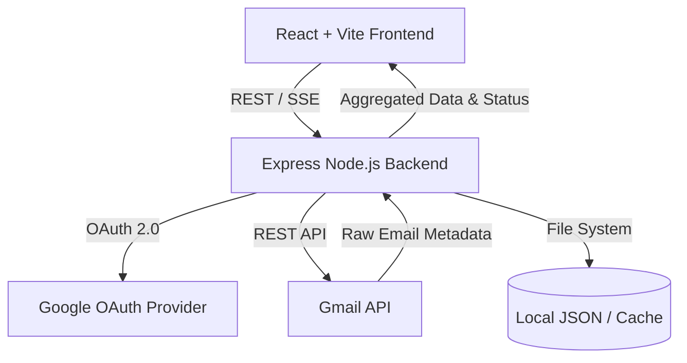

# System Architecture & Design

This document provides a comprehensive overview of the EmailDiet architecture, breaking down the High-Level Design (HLD) and Low-Level Design (LLD).

## 1. High-Level Design (HLD)

The system follows a strict **stateless, no-database** architecture. The application acts as an intelligent proxy and analysis layer sitting on top of the Gmail API. **Gmail is the sole source of truth.**

### Core Tenets
1. **No Persistent Database:** The app does not store emails, user profiles, or relational data in a traditional database (e.g., PostgreSQL, MongoDB). Everything is fetched from Gmail on the fly, with temporary file-system caching (in `data/`) for session performance.
2. **Safe Deletion:** The system only moves emails to the Gmail **Trash**. It never issues a permanent delete command. Users have 30 days to recover any accidentally deleted emails directly from their Gmail Trash.
3. **Event-Driven UI:** Because scanning a mailbox and bulk-unsubscribing can take several minutes, the client-server communication relies heavily on **Server-Sent Events (SSE)** to stream progress back to the user in real-time.

### Data Flow Overview

## 2. Low-Level Design (LLD)

### 2.1 Backend (Server)
The backend is a Node.js application built with Express. It heavily utilizes the `googleapis` SDK.

#### Key Modules
- **`src/auth/`**: Manages OAuth 2.0 flow, token exchange, and refresh logic. Keeps tokens in a transient/local store per session.
- **`src/gmail/`**: Contains the core `client.js` wrapping the Gmail API. Includes `rateLimiter.js` which uses `p-limit` for concurrency control and implements exponential backoff to handle Google API rate limits smoothly.
- **`src/routes/`**: Express controllers handling specific domains:
  - `/api/auth`: Login, logout, callback.
  - `/api/scan`: Mailbox scanning and sender aggregation.
  - `/api/inbox`: Inbox group fetching and quick-filtering.
  - `/api/digest`: Weekly digest configuration and execution.
- **`src/services/`**: The core business logic.
  - **`storageService.js`**: Analyzes large attachments and aggregates size by sender, month, and year.
  - **`protectService.js`**: Maintains a local/cached list of protected senders (banks, utilities) to prevent accidental unsubscribing.
- **`src/jobs/`**: Background job execution. Uses SSE to emit `{ phase, processed, total }` status updates to the client during long-running tasks.

### 2.2 Frontend (Client)
The frontend is a React 18 Single Page Application (SPA) built with Vite and TypeScript.

#### Key Modules
- **State Management**: Uses React standard hooks (`useState`, `useEffect`) and custom hooks like `useAuth` (managing session state) and `useJob` (managing SSE connections and streaming state).
- **UI Framework**: Built with **Chakra UI v2** (supported by Emotion and Framer Motion). The application follows Apple Human Interface Guidelines (HIG) for styling (e.g., `bg.glass`, frosted materials, SF Pro font stack).
- **Network Layer**: `src/api.ts` handles REST endpoints and sets up SSE listeners for asynchronous jobs.

#### Layout Patterns
The UI heavily utilizes a **Two-Pane Master-Detail** layout across its primary tabs (Mailbox, Storage, Labels). 
- **Left Pane (`GridItem md=4 lg=3`)**: Navigation, filters, and high-level aggregation (e.g., list of segments or size bands).
- **Right Pane (`GridItem md=8 lg=9`)**: Detailed list views, data tables, and dynamic floating action trays (`position="absolute"`) for context-aware bulk actions.

### 2.3 Security Model
- **Token Storage**: OAuth refresh and access tokens are kept out of the browser. The server issues an HTTP-only secure cookie for session identification, mapping to tokens in the server's `data/` directory.
- **Header Injection Protection**: The unsubscribe engine sanitizes all `mailto:` flows to prevent SMTP header injection attacks.
- **Network Boundaries**: One-click unsubscribe HTTP POST requests (RFC 8058) strictly deny private, loopback, or non-HTTPS URLs.
