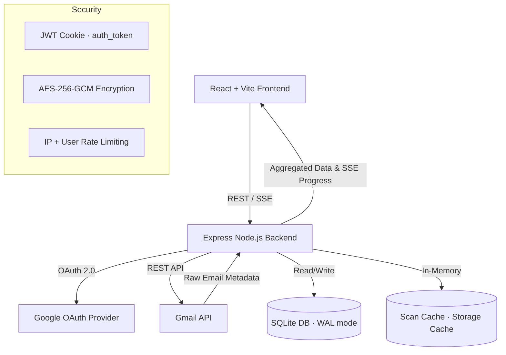

# EmailDiet — System Architecture, Design & Implementation Reference

**Version:** 1.0 · **Last Updated:** 2026-07-11
**Status:** Multi-User SaaS · Production-Ready · 55 tests passing · Clean production build

> This is the consolidated reference for EmailDiet's **architecture** (HLD + LLD) and **implementation details** (database schema, auth flow, service layer). Section 7 summarizes the design system; the full styling rulebook lives in [`DESIGN.md`](DESIGN.md).

---

## Table of Contents

1. [System Overview](#1-system-overview)
2. [High-Level Design (HLD)](#2-high-level-design-hld)
3. [Technology Stack](#3-technology-stack)
4. [System Architecture Diagram](#4-system-architecture-diagram)
5. [Backend Low-Level Design (LLD)](#5-backend-low-level-design-lld)
   - [Entry Point & Middleware Pipeline](#51-entry-point--middleware-pipeline)
   - [Database Layer](#52-database-layer)
   - [Authentication & Sessions](#53-authentication--sessions)
   - [Gmail Integration Layer](#54-gmail-integration-layer)
   - [Services Layer](#55-services-layer)
   - [Job System & SSE Streaming](#56-job-system--sse-streaming)
   - [Store Layer (Caching)](#57-store-layer-caching)
   - [API Routes](#58-api-routes)
   - [Configuration](#59-configuration)
6. [Frontend Low-Level Design (LLD)](#6-frontend-low-level-design-lld)
   - [Component Architecture](#61-component-architecture)
   - [State Management & Hooks](#62-state-management--hooks)
   - [Network Layer (API Client)](#63-network-layer-api-client)
   - [Utilities](#64-utilities)
   - [Theme System](#65-theme-system)
7. [Design System (Apple HIG)](#7-design-system-apple-hig)
   - [Typography](#71-typography)
   - [Color System](#72-color-system)
   - [Spacing, Layout & Shapes](#73-spacing-layout--shapes)
   - [Component Inventory](#74-component-inventory)
8. [Security Model](#8-security-model)
9. [Data Flow Diagrams](#9-data-flow-diagrams)
10. [Database Schema](#10-database-schema)
11. [Test Coverage](#11-test-coverage)

---

## 1. System Overview

EmailDiet is a full-stack **multi-user SaaS application** that connects to users' Gmail accounts via OAuth 2.0 and provides powerful tools to:

- **Scan & categorize** subscription/promotional emails grouped by sender
- **Bulk unsubscribe** via RFC 8058 one-click, mailto, or browser link
- **Reclaim storage** by analyzing large emails and attachments
- **Organize** emails with auto-categorized Gmail labels
- **Protect** important senders (banks, government, utilities) from accidental actions
- **Export** sender data as Excel files for external analysis
- **Schedule** weekly digest emails to detect new senders

Every user account is strictly isolated using SQLite foreign keys (`user_id`), HTTP-only JWT cookies, and AES-256-GCM token encryption at rest. Gmail is the sole source of truth — the app never stores email content, only metadata caches. All deletions use Gmail Trash (recoverable for 30 days); there is no permanent-delete call in the codebase.

---

## 2. High-Level Design (HLD)

### Core Tenets

| Tenet | Description |
|-------|-------------|
| **Gmail as source of truth** | The app never stores emails. All data is fetched from Gmail on the fly with in-memory caching for session performance. |
| **Safe deletion only** | Every "trash" operation uses Gmail's `TRASH` label. No `messages.delete` call exists. Users have 30 days to recover in Gmail. |
| **Event-driven UI** | Long-running operations (scan, unsubscribe, trash) stream progress via **Server-Sent Events (SSE)** with automatic poll fallback. |
| **Multi-user tenant isolation** | SQLite with `ON DELETE CASCADE` foreign keys ensures complete data isolation. Each user can only access their own tokens, protected senders, labels, and activity logs. |
| **Zero email body storage** | Only metadata headers (From, Subject, Date, List-Unsubscribe) are read. The app never accesses email bodies or attachments. |

---

## 3. Technology Stack

| Layer | Technologies |
|-------|-------------|
| **Frontend** | React 18 + TypeScript, Vite 6, Chakra UI v2, Framer Motion, SheetJS (xlsx) |
| **Backend** | Node.js + Express (ESM modules), Google APIs (`googleapis`) |
| **Auth & Sessions** | Google OAuth 2.0 with HTTP-only signed JWT session cookies (`auth_token`) |
| **Security** | AES-256-GCM token encryption at rest (NIST SP 800-38D, 12-byte IVs, 16-byte auth tags), per-user API rate limiting |
| **Database** | SQLite (`better-sqlite3`) in Write-Ahead Log (`WAL`) concurrency mode with foreign key cascade isolation |
| **Testing** | Node.js built-in test runner (`node --test`), 55 unit tests across 7 suites |
| **Monorepo** | npm workspaces (`client/` + `server/`) |

### Server Dependencies

| Package | Purpose |
|---------|---------|
| `express` | HTTP server and routing |
| `better-sqlite3` | SQLite database with WAL mode |
| `googleapis` | Gmail API v1 client |
| `jsonwebtoken` | JWT session tokens |
| `cookie-parser` | HTTP-only cookie parsing |
| `cors` | Cross-origin resource sharing |
| `express-rate-limit` | Per-IP and per-user rate limiting |
| `p-limit` | Gmail API concurrency control |
| `dotenv` | Environment variable loading |

### Client Dependencies

| Package | Purpose |
|---------|---------|
| `react` / `react-dom` | UI framework |
| `@chakra-ui/react` / `@chakra-ui/icons` | Component library |
| `@emotion/react` / `@emotion/styled` | CSS-in-JS (Chakra dependency) |
| `framer-motion` | Animations and transitions |
| `progressbar.js` | Animated progress indicators |
| `xlsx` (SheetJS) | Client-side Excel file generation |

---

## 4. System Architecture Diagram

```
┌────────────────────────────────────────────────────────────────────────┐
│                        CLIENT (Vite + React 18)                        │
│                                                                        │
│  LandingPage (Unauthed) ─→ App (Tab Router) ─┬→ MailboxTab             │
│                                              ├→ StorageTab             │
│                                              ├→ LabelManager           │
│                                              └→ AccountPage            │
│                                                                        │
│  Shared: ScanControls, SenderTable, FilterToolbar, AccountBadge        │
└───────────────────────────────────┬────────────────────────────────────┘
                                    │ HTTP REST + SSE
                                    │ credentials: 'include' (JWT cookie)
                                    ▼
┌────────────────────────────────────────────────────────────────────────┐
│                        SERVER (Express API)                            │
│                                                                        │
│  index.js ─→ CORS + CookieParser + GlobalRateLimit ─→ authMiddleware   │
│                                                                        │
│  ┌──────────────────────────────────────────────────────────────────┐  │
│  │                   PUBLIC ROUTES (no auth)                        │  │
│  │  GET /api/health · /api/auth/* · /legal/*                        │  │
│  ├──────────────────────────────────────────────────────────────────┤  │
│  │              PROTECTED ROUTES (JWT + per-user rate limit)        │  │
│  │  auth · user · scan · inbox · storage · labels · unsubscribe     │  │
│  │  protect · messages · jobs · digest                              │  │
│  └────────────────────────────────┬─────────────────────────────────┘  │
│                                   ▼                                    │
│  ┌──────────────────────────────────────────────────────────────────┐  │
│  │                      SERVICES (Scoped by userId)                 │  │
│  │  scanService · inboxService · storageService · unsubscribeService│  │
│  │  labelService · protectService · retentionService · trashService │  │
│  │  messageTrashService · categorizer · headerParser                │  │
│  │  digestService · digestRunner · subscriptionsService             │  │
│  │  auditService                                                    │  │
│  └────────────────────────────────┬─────────────────────────────────┘  │
│                                   ▼                                    │
│  ┌──────────────────────────────────────────────────────────────────┐  │
│  │                    DATA & INFRASTRUCTURE LAYER                   │  │
│  │  db.js & crypto.js — SQLite WAL + AES-256-GCM encryption        │  │
│  │  jwt.js & authMiddleware.js — Signed JWT session verification    │  │
│  │  rateLimitMiddleware.js — Global IP + per-user rate limiting     │  │
│  │  jobManager.js & scheduler.js — User-scoped async background    │  │
│  │  scanCache.js / labelRegistry.js / digestStore.js — caches      │  │
│  └────────────────────────────────┬─────────────────────────────────┘  │
└───────────────────────────────────┼────────────────────────────────────┘
                                    │
                    ┌───────────────┴───────────────┐
                    ▼                               ▼
       ┌─────────────────────────┐    ┌──────────────────────────┐
       │      Gmail API v1       │    │     SQLite Database      │
       │  (googleapis library)   │    │  (emaildiet.db WAL mode) │
       │  • messages.list/get    │    │  • users, tokens         │
       │  • messages.modify      │    │  • preferences           │
       │  • messages.trash       │    │  • protected_senders     │
       │  • messages.send        │    │  • label_registry        │
       │  • labels.create/list   │    │  • activity_log          │
       │  • users.getProfile     │    │  • digest_baseline       │
       └─────────────────────────┘    └──────────────────────────┘
```

### Data Flow (Mermaid)



---

## 5. Backend Low-Level Design (LLD)

### 5.1 Entry Point & Middleware Pipeline

**File:** `server/src/index.js`

The Express app initializes in this order:

```
1. getDb()              → Initialize SQLite database on boot
2. cors()               → CORS with credentials support
3. cookieParser()       → Parse auth_token HTTP-only cookie
4. express.json()       → JSON body parsing
5. globalRateLimiter    → 100 req/min per IP (all routes)
6. ── PUBLIC ROUTES ──
   /api/health          → { ok: true }
   /legal/*             → Privacy policy, terms
   /api/auth/*          → OAuth flow (no auth required)
7. authMiddleware       → Verify JWT, set req.userId
8. userRateLimiter      → 60 req/min per userId
9. ── PROTECTED ROUTES ── (all require auth)
10. Error middleware     → NotConnectedError → 401, else 500
11. startScheduler()    → Cron for weekly digest emails
12. SIGTERM handler     → closeDb() + graceful shutdown
```

### 5.2 Database Layer

**Files:** `server/src/db/db.js`, `server/src/db/crypto.js`

| Module | Description |
|--------|-------------|
| `db.js` | Singleton `better-sqlite3` instance with WAL mode, `foreign_keys = ON`, and auto-migration via embedded `CREATE TABLE IF NOT EXISTS` statements. Creates the data directory and all 7 tables + 4 indexes on first run. |
| `crypto.js` | AES-256-GCM encryption/decryption for OAuth tokens at rest. Uses NIST SP 800-38D compliant 12-byte (96-bit) IVs and 16-byte authentication tags. Key is derived from `TOKEN_ENCRYPTION_KEY` env via SHA-256 normalization. |

**Encryption flow:**
```
encryptTokens(tokens)
  → JSON.stringify → AES-256-GCM cipher → base64 encrypted + authTag
  → returns { encrypted: "data.tag", iv: "base64iv" }

decryptTokens({ encrypted, iv })
  → split encrypted.tag → AES-256-GCM decipher → JSON.parse → tokens
```

### 5.3 Authentication & Sessions

**Files:** `server/src/auth/oauthClient.js`, `jwt.js`, `authMiddleware.js`, `rateLimitMiddleware.js`

| Module | Description |
|--------|-------------|
| `oauthClient.js` | OAuth2 client creation, auth URL generation with CSRF state tokens (10-min TTL), callback token exchange (fetches Google `userinfo` for `sub`/`email`/`name`/`picture`), upserts into `users` table, encrypts and stores tokens, automatic token refresh, `withAuthErrorHandling` wrapper (converts `invalid_grant` → 401), and revoke/logout. |
| `jwt.js` | `signToken(userId)` → 7-day JWT with `{ sub: userId }`. `verifyToken(token)` → decoded payload or throws `TokenExpiredError`. Uses `JWT_SECRET` from env (auto-generates random 64-byte secret if missing, with console warning). |
| `authMiddleware.js` | Reads `auth_token` HTTP-only cookie → verifies JWT → sets `req.userId`. Returns 401 with descriptive error codes (`not_authenticated`, `token_expired`, `invalid_token`). |
| `rateLimitMiddleware.js` | Two layers: `globalRateLimiter` (100 req/min per IP, applied to all routes) and `userRateLimiter` (configurable via `RATE_LIMIT_PER_MINUTE` env, default 60 req/min per `userId`, applied after auth). |

**Full OAuth login flow:**
```
1. User clicks "Sign in with Google"
2. GET /api/auth/url → server generates OAuth URL with CSRF state token
3. Browser redirects to Google consent screen
4. Google redirects to GET /api/auth/callback?code=...&state=...
5. Server verifies CSRF state, exchanges code for tokens
6. Server fetches Google userinfo (sub, email, name, picture)
7. Server upserts user into SQLite `users` table
8. Server encrypts tokens → stores in `tokens` table
9. Server signs JWT → sets `auth_token` HTTP-only SameSite=Lax cookie
10. Server redirects to CLIENT_URL (dashboard)
```

### 5.4 Gmail Integration Layer

**Files:** `server/src/gmail/client.js`, `messages.js`, `mime.js`, `rateLimiter.js`

| Module | Description |
|--------|-------------|
| `client.js` | `getGmail(userId)` — loads encrypted tokens from SQLite, decrypts, creates per-user `gmail.users` authorized client. |
| `messages.js` | `listAllMessageIds(gmail, query, opts)` — paginated message ID listing with progress callbacks and AbortSignal support. `getMetadata(gmail, ids, opts)` — parallel metadata fetch with concurrency control. |
| `mime.js` | `parseMailto(uri)` — RFC-compliant mailto URI parsing. `buildUnsubscribeEmail(to, subject, body)` — raw MIME construction with header-injection sanitization. `base64url` encoding. |
| `rateLimiter.js` | Shared `p-limit(20)` concurrency limiter with exponential backoff (500ms → 32s + jitter) on 429/5xx/403-rate-limit errors, up to 5 retry attempts. |

### 5.5 Services Layer

All services are scoped by `userId` — every function accepts `userId` as the first parameter and uses it to access per-user data.

| Service | Key Functions | Description |
|---------|--------------|-------------|
| **`scanService.js`** | `scanSenders`, `runScan`, `scanView` | Lists candidate messages (promotions/updates/social/forums or containing "unsubscribe"), fetches metadata, groups by sender, determines best unsubscribe method per sender. Configurable time range (1m/3m/6m/1y/all). Caches results in memory per user. |
| **`inboxService.js`** | `listGroups`, `getGroup` | Reports live counts for 11 inbox groups (Important, Primary, Marketing, Social, Updates, Forums, Starred, Unread, With Attachments, Large >5MB, Stale Unread 6mo+). Label-backed groups use exact counts; query-backed use estimates. |
| **`storageService.js`** | `getStorageStats`, `getDrillDownMessages` | Scans all emails >500KB, aggregates by sender (top 10), month (all), year, size band (6 bands from <500KB to >25MB), and large attachments (>5MB). 5-minute in-memory cache per user. |
| **`unsubscribeService.js`** | `runUnsubscribe` | Executes unsubscribe for a sender using best method: **one-click POST** (RFC 8058), **mailto** (sends email via Gmail API), or **browser link** (returns URL). Includes SSRF protection (rejects private IPs, localhost, non-HTTPS). |
| **`labelService.js`** | `runApplyLabels`, `removeLabels` | Creates Gmail labels under configurable prefix (`Unsub/`), batch-applies them to scanned messages (1,000 per batch), manages label registry in SQLite. |
| **`protectService.js`** | `autoProtectFromScan`, `protectSenders`, `isProtected` | Auto-detects senders from banks, government, utilities, insurance based on domain and subject keyword heuristics. Protected sender list stored in SQLite per user. |
| **`categorizer.js`** | `categorize`, `suggestCategory` | Classifies senders into 18 categories (Promotions, Newsletters, Social, Shopping, Finance, Travel, Work, Banking, etc.) using domain matching, Gmail category labels, and subject keywords. Returns confidence scores. |
| **`headerParser.js`** | `parseFrom`, `unsubscribeInfo`, `parseListUnsubscribe` | Parses RFC 2047 encoded `From` headers, extracts `List-Unsubscribe` and `List-Unsubscribe-Post` headers, determines best unsubscribe method (one-click > mailto > link > none). |
| **`trashService.js`** | `trashMessages` | Moves selected messages to Gmail Trash (recoverable 30 days). |
| **`messageTrashService.js`** | `trashMessagesBatch` | Batch trash with batched Gmail API calls. |
| **`retentionService.js`** | `keepLatest` | Keep-latest-N email retention logic — keeps N newest messages from a sender, trashes the rest. |
| **`digestService.js`** | `buildDigest`, `buildHtml`, `buildMimeEmail` | Pure builders for the weekly digest email (diff detection, HTML rendering, MIME construction). |
| **`digestRunner.js`** | `runDigest` | Orchestrates the digest flow: scan → diff against baseline → build email → send via Gmail → update baseline. |
| **`subscriptionsService.js`** | `detectSubscriptions` | Detects recurring paid services (Netflix, Spotify, etc.) from scan results using vendor pattern matching and cadence estimation. |
| **`auditService.js`** | `logActivity`, `getActivity` | Inserts action records into `activity_log` table and queries with pagination and optional type filter. |

### 5.6 Job System & SSE Streaming

**Files:** `server/src/jobs/jobManager.js`, `scheduler.js`, `server/src/routes/jobs.js`

| Module | Description |
|--------|-------------|
| `jobManager.js` | UUID-based async job manager scoped by `userId`. Supports `createJob(userId, name, runner)`, `cancelJob(userId, id)`, `getJob(userId, id)`, `isJobRunning(userId, name)`. Uses `EventEmitter` for progress streaming. State tracking: `running` → `done` / `error` / `cancelled`. Auto-prunes finished jobs (keeps last 50). Cancellation via `AbortController`. |
| `scheduler.js` | Cron-style scheduler that runs every minute. Iterates over all users with `digest_enabled = 1`, checks `isDigestDue(day, hour)`, and triggers digest runs with per-user error isolation. |
| `routes/jobs.js` | `GET /:id` — poll job snapshot. `POST /:id/cancel` — cancel a running job. `GET /:id/events` — SSE endpoint with resilient destroyed-socket guards, once-only cleanup, and heartbeat pings every 15s. |

**Supported job types:**
- `scan` — Inbox scan for subscription senders
- `unsubscribe` — Execute batch unsubscribe actions
- `apply-labels` — Batch label application
- `trash` — Batch message trashing (per-sender and per-filter)
- `keep-latest` — Retention engine
- `digest` — Weekly digest email

**SSE resilience:** The SSE endpoint uses `safeSend()` with `res.destroyed || res.writableEnded` guards, try/catch on every write, once-only cleanup via a `cleaned` flag, and heartbeat liveness checks to prevent `ECONNRESET` errors through the Vite dev proxy.

### 5.7 Store Layer (Caching)

| Store | Persistence | Description |
|-------|------------|-------------|
| `scanCache.js` | In-memory (Map keyed by userId) | Scan results cache. Lost on server restart. |
| `labelRegistry.js` | SQLite (`label_registry` table) | Mapping of created label names → Gmail label IDs per user. |
| `digestStore.js` | SQLite (`preferences` + `digest_baseline` tables) | Digest settings, known-sender baseline, and run history per user. |

### 5.8 API Routes

| Route Group | Endpoints | Auth | Purpose |
|-------------|-----------|------|---------|
| `GET /api/health` | Health check | ✗ | Returns `{ ok: true }` |
| `/legal/*` | Privacy, Terms | ✗ | Legal pages for OAuth verification |
| `/api/auth` | `GET /url`, `GET /callback`, `GET /status`, `POST /logout` | ✗ | OAuth flow |
| `/api/user` | `GET /profile`, `GET/PUT /preferences`, `GET /activity`, `DELETE /account` | ✓ | User profile & settings |
| `/api/scan` | `POST /scan`, `GET /scan`, `GET /senders`, `GET /suggestions`, `GET /subscriptions` | ✓ | Scan management |
| `/api/inbox` | `GET /groups`, `GET /group/:key/messages`, `GET /filters`, `POST /filter/messages`, `POST /filter/:key/trash` | ✓ | Inbox analytics |
| `/api/storage` | `GET /stats`, `GET /drill`, `POST /refresh` | ✓ | Storage analysis |
| `/api/labels` | `POST /apply`, `DELETE /:name`, `GET /labels` | ✓ | Label management |
| `/api/unsubscribe` | `POST /unsubscribe` | ✓ | Execute unsubscribe |
| `/api/protect` | `GET /protected`, `POST /protect`, `DELETE /protect` | ✓ | Protected senders |
| `/api/messages` | `POST /trash` | ✓ | Trash messages |
| `/api/jobs` | `GET /:id`, `POST /:id/cancel`, `GET /:id/events` | ✓ | Job management & SSE |
| `/api/digest` | `GET /state`, `POST /settings`, `POST /run`, `POST /test` | ✓ | Digest configuration |

### 5.9 Configuration

**File:** `server/src/config.js`

Environment-driven configuration via `.env`:

| Variable | Default | Description |
|----------|---------|-------------|
| `GOOGLE_CLIENT_ID` | *(required)* | Google OAuth client ID |
| `GOOGLE_CLIENT_SECRET` | *(required)* | Google OAuth client secret |
| `PORT` | `3001` | API server port |
| `HOST` | `127.0.0.1` | Bind address (loopback for security) |
| `REDIRECT_URI` | `http://localhost:3001/api/auth/callback` | OAuth redirect |
| `CLIENT_URL` | `http://localhost:5173` | Frontend URL |
| `DB_PATH` | `server/data/emaildiet.db` | SQLite database path |
| `JWT_SECRET` | *(auto-generated)* | JWT signing secret (⚠️ sessions won't survive restart without this) |
| `TOKEN_ENCRYPTION_KEY` | *(required)* | AES-256-GCM encryption key for tokens at rest |
| `COOKIE_DOMAIN` | `undefined` | Cookie domain (set for cross-subdomain deployment) |
| `CORS_ORIGIN` | Same as `CLIENT_URL` | CORS allowed origin |
| `SCAN_MAX_MESSAGES` | `Infinity` (no cap) | Max messages to scan |
| `RATE_LIMIT_PER_MINUTE` | `60` | Per-user rate limit |

**OAuth Scopes:**
- `gmail.modify` — Read, label, trash emails
- `gmail.send` — Send unsubscribe emails
- `userinfo.profile` — Google display name and avatar
- `userinfo.email` — Google email address

---

## 6. Frontend Low-Level Design (LLD)

### 6.1 Component Architecture

```
App.tsx (Tab navigation + auth state + theme)
├── LandingPage.tsx        — SaaS marketing page (unauthenticated view)
├── ConnectScreen.tsx       — Legacy OAuth login card
├── AccountBadge.tsx        — User avatar, email, profile trigger, logout
├── AccountPage.tsx         — Full profile, preferences, activity audit log
├── UserProfileModal.tsx    — Profile & preferences modal (alternative view)
│
├── MailboxTab.tsx           — Primary sender management view
│   ├── ScanControls.tsx     — Scan launcher + time range + stats
│   ├── ScanLoader.tsx       — Animated scan progress display
│   ├── FilterToolbar.tsx    — Smart filter chips (engagement/cleanup/category)
│   ├── SenderTable.tsx      — Sortable sender table with bulk selection
│   ├── UnsubscribePanel.tsx — Unsubscribe progress/results display
│   ├── LabelReview.tsx      — Label assignment review dialog
│   ├── ProtectedTab.tsx     — Protected sender management
│   └── ConfirmDialog.tsx    — Typed confirmation for destructive actions
│
├── StorageTab.tsx           — Left/right pane storage analyzer
│   └── DrillPanel (inline)  — Filterable message detail table
│
├── LabelManager.tsx         — System/User/App label sidebar + message drill-down
│
└── DigestSettingsDialog.tsx  — Weekly digest configuration modal

Shared Utilities:
├── AnimatedProgress.tsx     — ProgressBar.js animated circular/linear indicators
├── EmailLoader.tsx          — Animated envelope loader for async operations
└── ConfirmDialog.tsx        — Standard armed-delay confirmation
```

### 6.2 State Management & Hooks

| Hook | File | Description |
|------|------|-------------|
| `useJob` | `hooks/useJob.ts` | Manages async job lifecycle: starts a job via POST, opens SSE stream to `/api/jobs/:id/events`, falls back to 2s polling on SSE error. Returns `{ job, running, start, cancel }`. |
| `useAuth` | `hooks/useAuth.ts` | Authentication state management. Checks `/api/auth/status` on mount, provides `login`, `logout`, `connected`, `user` state. |
| `useAutoClearAlert` | `hooks/useAutoClearAlert.ts` | Auto-clears alert messages after a timeout. |

### 6.3 Network Layer (API Client)

**File:** `client/src/api.ts`

Typed HTTP client with `ApiError` class. All requests use `credentials: 'include'` for cookie-based auth. Methods for every API endpoint, organized by domain.

### 6.4 Utilities

| File | Description |
|------|-------------|
| `utils/exportExcel.ts` | Client-side Excel export using SheetJS. `exportToExcel(senders)` maps sender data to rows with Email, Name, First Name, Last Name, Domain columns. Splits names on first space. Auto-sizes column widths. Downloads as `Email_export_<unix_timestamp>.xlsx`. |
| `cache.ts` | Client-side caching utility for API responses. |

### 6.5 Theme System

**Files:** `theme/themes.ts`, `theme/ThemeContext.tsx`

| Module | Description |
|--------|-------------|
| `themes.ts` | Two curated Chakra UI themes — **Botanical Forest** (nature-inspired greens/teals on warm backgrounds) and **Espresso** (rich warm browns/coppers on cream). Both include full dark mode `_dark` variants, semantic tokens (`bg.app`, `bg.card`, `bg.glass`, `text.primary`, `text.secondary`, `border.glass`, `brand.icon`), and component overrides. |
| `ThemeContext.tsx` | React context providing `theme` (botanical/espresso) and `toggleTheme`. Persists preference in localStorage. Detects OS `prefers-color-scheme` for initial dark mode. |

---

## 7. Design System (Apple HIG)

The app follows an **Apple Human Interface Guidelines (HIG)**-inspired design language: system fonts, Apple system colors, rounded rectangles, translucent materials, hairline separators, and restrained shadows.

### 7.1 Typography

| Element | Specification |
|---------|--------------|
| **Primary Font** | `-apple-system, BlinkMacSystemFont, "SF Pro Text", "SF Pro Display", "Helvetica Neue", Helvetica, Arial, sans-serif` (renders SF on Apple devices, native sans elsewhere, no web-font import) |
| **Mono Font** | `ui-monospace, "SF Mono", "SFMono-Regular", Menlo, Consolas, monospace` |
| **Scale** | 15px body, 13px secondary body, 17–22px section titles, 28px page title |
| **Letter-spacing** | Negative (`-0.01em` to `-0.02em`) on headings |
| **Weights** | 400 body, 500/590/600 controls/labels, 700 headers |

### 7.2 Color System

Apple system colors exposed as Chakra UI semantic tokens and CSS variables:

```css
:root {
  --color-dominant: #1C1C1E;              /* primary text/icons */
  --color-dominant-light: #F2F2F7;        /* systemGroupedBackground */
  --color-accent: #007AFF;                /* systemBlue (primary actions) */
  --color-accent-soft: rgba(0,122,255,0.10);
  --hairline: rgba(60,60,67,0.18);        /* separator */
}
```

**Full system palette:** Blue `#007AFF`, Indigo `#5856D6`, Green `#34C759`, Orange `#FF9500`, Red `#FF3B30`, Pink `#FF2D55`, Teal `#00C7BE`. Secondary text: `rgba(60,60,67,0.60)`. Single accent (systemBlue) for primary actions — no per-tab accent colors.

### 7.3 Spacing, Layout & Shapes

| Element | Specification |
|---------|--------------|
| **Grid** | 8px rhythm (8/16/24/32/48/64) |
| **Card corners** | 14px rounded rectangles |
| **Dialog corners** | 18px |
| **Floating trays** | 16px corners |
| **Inputs/buttons** | 10px corners |
| **Chips/badges** | 8px corners |
| **Shadows** | Restrained: `0 1px 2px rgba(0,0,0,0.04), 0 10px 30px rgba(0,0,0,0.05)` |
| **Toolbar material** | `rgba(255,255,255,0.72)` with `backdrop-filter: saturate(180%) blur(20px)` |
| **Action tray material** | `rgba(28,28,30,0.92)` with backdrop blur, white text |
| **Separators** | Hairline borders at `rgba(60,60,67,0.10–0.18)` |
| **Layout pattern** | Two-Pane Master-Detail: left `GridItem md=4 lg=3` (navigation/filters), right `GridItem md=8 lg=9` (tables/detail) |
| **Table aesthetics** | Sentence Case headers, `brand.50` background, 1px border, inset 3px left-edge highlight on selected rows (no background color change), standard pagination |

### 7.4 Component Inventory

| Component | Purpose |
|-----------|---------|
| `LandingPage` | Full-page SaaS marketing hero, benefits, trust signals, Google OAuth login |
| `UserProfileModal` | Account profile, preferences editor, activity audit log modal |
| `AccountBadge` | User avatar, email, profile modal trigger, logout |
| `ConfirmDialog` | Standard confirmation dialog (arming delay + typed confirm) |
| `ConnectScreen` | Legacy OAuth login card |
| `EmailLoader` | Animated envelope loader for async operations |
| `FilterToolbar` | Preset query chip toolbar for email filtering |
| `LabelManager` | Label creation, application, and management system |
| `LabelReview` | Inline label inspector and category assignment |
| `ProtectedTab` | Protected sender whitelist manager |
| `ScanControls` | Scan trigger buttons with status messages |
| `ScanLoader` | Scan progress animation (listing → fetching → grouping) |
| `SenderTable` | Sender table with selection, volume stats, category badges |
| `StorageTab` | Storage analyzer with drill-down by sender/month/year/size |
| `UnsubscribePanel` | Batch unsubscribe progress and results display |
| `DigestSettingsDialog` | Weekly digest schedule and recipient configuration |
| `AnimatedProgress` | ProgressBar.js animated indicators |
| `AccountPage` | Full profile, preferences, activity log (dedicated page) |

---

## 8. Security Model

| Layer | Implementation |
|-------|---------------|
| **OAuth 2.0** | Google OAuth with CSRF state tokens (10-minute TTL, 16-byte random) |
| **Session cookies** | HTTP-only, `SameSite=Lax`, signed JWT (`auth_token`), 7-day expiry |
| **Token encryption** | AES-256-GCM with NIST SP 800-38D compliant 12-byte IVs and 16-byte auth tags. Key derived via SHA-256 from env variable. |
| **Token refresh** | Automatic refresh with `invalid_grant` detection → 401 + token deletion |
| **Rate limiting** | Global: 100 req/min per IP. Per-user: 60 req/min (configurable). Scan concurrency: max 1 per user. |
| **SSRF protection** | One-click unsubscribe POST restricted to HTTPS; DNS resolution blocks private IPs, localhost, and loopback addresses |
| **Header injection** | Sanitization in MIME email construction for mailto unsubscribe flows |
| **Gmail scopes** | Minimal: `gmail.modify` + `gmail.send` (no `gmail.readonly` or full access) |
| **Data isolation** | SQLite foreign keys with `ON DELETE CASCADE`. `req.userId` enforced at middleware level before any route handler executes. |
| **Safe deletion** | Only Gmail Trash (30-day recovery). No `messages.delete` call exists in the codebase. |
| **Protect-list enforcement** | Unsubscribe, trash, keep-latest, and filter-trash all check `isProtected()` before acting. |

---

## 9. Data Flow Diagrams

### Scan Flow
```
User clicks "Scan" → POST /api/scan { range: "6m" }
  → jobManager.createJob(userId, 'scan', runner)
    → gmail.messages.list (paginated, rate-limited, AbortSignal)
      SSE: { phase: "listing", listed: 150 }
    → gmail.messages.get (parallel × 20, rate-limited)
      SSE: { phase: "fetching", fetched: 80, total: 150 }
    → Group by sender, detect unsubscribe methods, categorize
      SSE: { phase: "grouping", total: 150 }
    → Cache in scanCache[userId]
  → Client polls GET /api/jobs/:id (or streams SSE /events)
  → Client fetches GET /api/scan for results
```

### Unsubscribe Flow
```
User selects senders → POST /api/unsubscribe { emails: [...] }
  → Filter out protected senders (report excluded count)
  → For each sender:
    → oneclick? → HTTPS POST to List-Unsubscribe URL (SSRF check)
    → mailto?   → Build MIME email → gmail.messages.send
    → link?     → Return URL for manual browser open
  → Return { total, success, manual, failed, results[] }
```

### Storage Analysis Flow
```
User opens Storage tab → GET /api/storage/stats
  → Fetch all emails > 500KB (paginated)
  → Aggregate by sender (top 10), month, year, size band
  → Cache for 5 minutes
  → Client renders left pane (aggregations) + right pane (drill-down)

User clicks month → GET /api/storage/drill?by=month&value=2025-06
  → Filter cached messages by month
  → Return sorted message list
```

### Excel Export Flow
```
User clicks ⬇ export icon in Senders toolbar
  → Client checks: selectedSenders.size > 0 ?
    → YES: export only selected from visibleSenders
    → NO:  export all visibleSenders (respects segment/category/search)
  → exportToExcel(senders):
    → splitName("John Smith") → { first: "John", last: "Smith" }
    → XLSX.utils.json_to_sheet → auto-size columns
    → XLSX.writeFile → browser download
    → File: Email_export_<unix_timestamp>.xlsx
```

---

## 10. Database Schema

```sql
-- 7 tables, all with ON DELETE CASCADE foreign keys to users(id)

CREATE TABLE users (
  id            TEXT PRIMARY KEY,        -- Google sub (unique, stable)
  email         TEXT NOT NULL UNIQUE,
  display_name  TEXT,
  avatar_url    TEXT,
  created_at    TEXT DEFAULT (datetime('now')),
  last_login_at TEXT
);

CREATE TABLE tokens (
  user_id       TEXT PRIMARY KEY REFERENCES users(id) ON DELETE CASCADE,
  encrypted     TEXT NOT NULL,           -- AES-256-GCM encrypted JSON blob
  iv            TEXT NOT NULL,           -- 12-byte IV (base64)
  updated_at    TEXT DEFAULT (datetime('now'))
);

CREATE TABLE preferences (
  user_id             TEXT PRIMARY KEY REFERENCES users(id) ON DELETE CASCADE,
  scan_max_messages   INTEGER,
  default_time_range  TEXT DEFAULT '3m',
  label_prefix        TEXT DEFAULT 'Unsub/',
  digest_enabled      INTEGER DEFAULT 0,
  digest_day          INTEGER NOT NULL DEFAULT 1,
  digest_hour         INTEGER NOT NULL DEFAULT 8,
  digest_recipient    TEXT NOT NULL DEFAULT ''
);

CREATE TABLE protected_senders (
  id        INTEGER PRIMARY KEY AUTOINCREMENT,
  user_id   TEXT NOT NULL REFERENCES users(id) ON DELETE CASCADE,
  email     TEXT NOT NULL,
  domain    TEXT,
  source    TEXT DEFAULT 'manual',      -- 'auto' | 'manual'
  added_at  TEXT DEFAULT (datetime('now')),
  UNIQUE(user_id, email)
);

CREATE TABLE label_registry (
  id          INTEGER PRIMARY KEY AUTOINCREMENT,
  user_id     TEXT NOT NULL REFERENCES users(id) ON DELETE CASCADE,
  label_name  TEXT NOT NULL,
  gmail_id    TEXT NOT NULL,
  created_at  TEXT DEFAULT (datetime('now')),
  UNIQUE(user_id, label_name)
);

CREATE TABLE activity_log (
  id          INTEGER PRIMARY KEY AUTOINCREMENT,
  user_id     TEXT NOT NULL REFERENCES users(id) ON DELETE CASCADE,
  action      TEXT NOT NULL,            -- 'login' | 'logout' | 'scan' | 'unsubscribe' | 'trash' | 'label' | 'keep_latest'
  details     TEXT,                     -- JSON blob with action-specific data
  created_at  TEXT DEFAULT (datetime('now'))
);

CREATE TABLE digest_baseline (
  user_id     TEXT PRIMARY KEY REFERENCES users(id) ON DELETE CASCADE,
  senders     TEXT,                     -- JSON array of known sender emails
  last_run_at TEXT,
  updated_at  TEXT DEFAULT (datetime('now'))
);

-- Performance indexes
CREATE INDEX idx_protected_senders_user ON protected_senders(user_id);
CREATE INDEX idx_label_registry_user ON label_registry(user_id);
CREATE INDEX idx_activity_log_user ON activity_log(user_id, created_at);
CREATE INDEX idx_activity_log_action ON activity_log(action);
```

---

## 11. Test Coverage

7 test suites with 55 tests covering core business logic:

| Suite | Tests | Coverage Area |
|-------|-------|---------------|
| `categorizer.test.js` | 7 | Domain matching, subject keywords, Gmail category fallback |
| `headerParser.test.js` | 14 | From parsing (RFC 2047), List-Unsubscribe extraction, one-click detection |
| `inboxService.test.js` | 4 | Group key uniqueness, label/query validation |
| `mime.test.js` | 4 | Mailto parsing, MIME building, header injection prevention, base64url |
| `protectService.test.js` | 7 | Domain/subject heuristics, auto-protect, protect/unprotect round-trip |
| `rateLimiter.test.js` | 6 | Retry logic, 429/5xx handling, non-retryable errors |
| `storageService.test.js` | 9 | Aggregation functions, size bands, byte conversion |
| `digestService.test.js` | — | Digest diff, HTML builder, MIME construction |
| `retentionService.test.js` | — | Keep-latest-N logic |
| `scheduler.test.js` | — | Digest scheduling, due-check logic |
| `inboxFilters.test.js` | — | Filter definition validation |
| `digestStore.test.js` | — | Store read/write round-trip |

**Running tests:**
```bash
npm test -w server        # Run all backend unit tests
npm run build -w client   # TypeScript check + Vite production build
npm run db:inspect -w server  # Inspect SQLite tables, row counts, samples
```

---

## File Index

### Server (`server/src/`)
```
server/src/
├── index.js                      # Express app entry, middleware pipeline, route mounting
├── config.js                     # Environment-driven configuration
├── auth/
│   ├── oauthClient.js            # Google OAuth2 flow, token management
│   ├── jwt.js                    # JWT sign/verify (7-day sessions)
│   ├── authMiddleware.js         # Cookie → JWT → req.userId middleware
│   └── rateLimitMiddleware.js    # Global IP + per-user rate limits
├── db/
│   ├── db.js                     # SQLite singleton, WAL mode, schema migration
│   └── crypto.js                 # AES-256-GCM token encryption/decryption
├── gmail/
│   ├── client.js                 # Per-user Gmail API client factory
│   ├── messages.js               # Paginated list + parallel metadata fetch
│   ├── mime.js                   # Mailto parsing, MIME builder, header sanitization
│   └── rateLimiter.js            # p-limit(20) + exponential backoff
├── services/
│   ├── scanService.js            # Mailbox scan + sender grouping
│   ├── inboxService.js           # 11 inbox group counts + drill-down
│   ├── storageService.js         # Large email analysis + size aggregation
│   ├── unsubscribeService.js     # RFC 8058 / mailto / link unsubscribe
│   ├── labelService.js           # Gmail label creation + batch application
│   ├── protectService.js         # Auto-protect heuristics + manual list
│   ├── categorizer.js            # 18-category sender classification
│   ├── headerParser.js           # From/List-Unsubscribe header parsing
│   ├── trashService.js           # Single message trash
│   ├── messageTrashService.js    # Batch message trash
│   ├── retentionService.js       # Keep-latest-N retention engine
│   ├── digestService.js          # Digest diff + HTML + MIME builders
│   ├── digestRunner.js           # Digest orchestration (scan → send)
│   ├── subscriptionsService.js   # Recurring vendor detection
│   └── auditService.js           # Activity log insert + query
├── store/
│   ├── scanCache.js              # In-memory scan results (per userId)
│   ├── labelRegistry.js          # SQLite label name → Gmail ID mapping
│   └── digestStore.js            # SQLite digest settings + baseline
├── routes/
│   ├── auth.js                   # OAuth login/callback/status/logout
│   ├── user.js                   # Profile, preferences, activity log
│   ├── scan.js                   # Scan trigger + results endpoints
│   ├── inbox.js                  # Inbox groups + filter messages
│   ├── storage.js                # Storage stats + drill-down
│   ├── labels.js                 # Label CRUD
│   ├── unsubscribe.js            # Unsubscribe execution
│   ├── protect.js                # Protected sender CRUD
│   ├── messages.js               # Message trash
│   ├── jobs.js                   # Job polling + SSE + cancel
│   ├── digest.js                 # Digest config + manual run
│   └── legal.js                  # Privacy/Terms pages
└── jobs/
    ├── jobManager.js             # Async job lifecycle manager
    └── scheduler.js              # Digest cron scheduler
```

### Client (`client/src/`)
```
client/src/
├── main.tsx                      # React entry point
├── App.tsx                       # Tab router, auth state, layout
├── api.ts                        # Typed HTTP client for all API endpoints
├── types.ts                      # TypeScript interfaces for API shapes
├── cache.ts                      # Client-side response caching
├── components/
│   ├── LandingPage.tsx           # SaaS marketing page (unauthenticated)
│   ├── ConnectScreen.tsx         # Legacy OAuth card
│   ├── AccountBadge.tsx          # User avatar + profile trigger
│   ├── AccountPage.tsx           # Full profile + preferences + audit log
│   ├── UserProfileModal.tsx      # Profile modal variant
│   ├── MailboxTab.tsx            # Primary sender management (45KB)
│   ├── ScanControls.tsx          # Scan launcher + time range
│   ├── ScanLoader.tsx            # Scan progress animation
│   ├── FilterToolbar.tsx         # Smart filter chips
│   ├── SenderTable.tsx           # Sortable sender table
│   ├── UnsubscribePanel.tsx      # Unsubscribe progress/results
│   ├── LabelReview.tsx           # Label assignment dialog
│   ├── ProtectedTab.tsx          # Protected sender list
│   ├── StorageTab.tsx            # Storage analyzer (37KB)
│   ├── LabelManager.tsx          # Label management (36KB)
│   ├── DigestSettingsDialog.tsx  # Digest schedule config
│   ├── ConfirmDialog.tsx         # Armed confirmation dialog
│   ├── AnimatedProgress.tsx      # ProgressBar.js indicators
│   └── EmailLoader.tsx           # Animated envelope loader
├── hooks/
│   ├── useJob.ts                 # Job lifecycle + SSE + poll fallback
│   ├── useAuth.ts                # Authentication state
│   └── useAutoClearAlert.ts      # Auto-dismiss alerts
├── utils/
│   └── exportExcel.ts            # Excel export with name splitting
└── theme/
    ├── themes.ts                 # Botanical + Espresso themes (dark/light)
    └── ThemeContext.tsx           # Theme switcher + persistence
```
